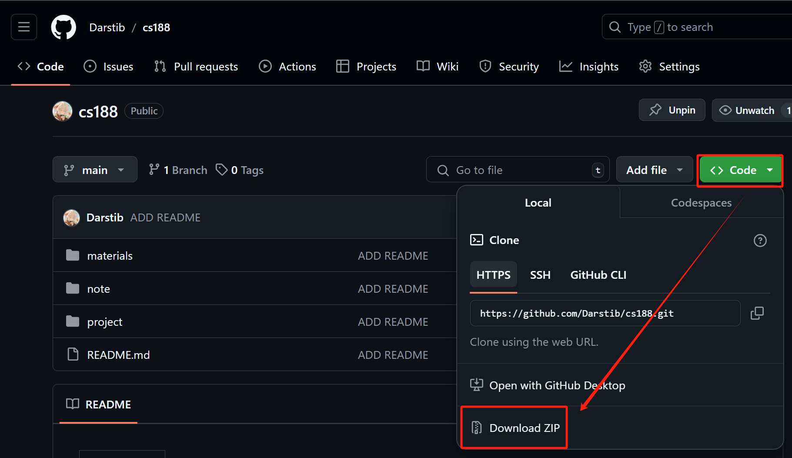
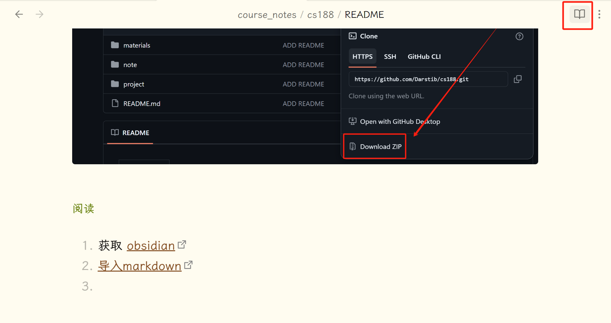

---
tags:
  - notes
comments: true
dg-publish: true
---

# cs188 - sp24

> There will be an English README when this project is completed.

> 目前已更新至 note 13/project 3

## 介绍

这个仓库存放的是 UCB [CS 188 Spring 2024](https://inst.eecs.berkeley.edu/~cs188/sp24/) 的笔记&自学资料；理论上，你学习该课程所需要的全部资料都可以在这里及给出的外链中找到。

- 笔记：主体为原课程 notes[^1]，加入了自己的思考和排版，在[我的博客](https://darstib.github.io/blog/note/CS188/)上你可以阅读这些笔记；但为了更好的观感，建议使用 obsidian 查看，见使用-阅读。
- 自学资料：由于 UCB 近年的部分课程开始需要[CalNet Authentication Service](https://auth.berkeley.edu/cas/login?service=https%3a%2f%2finst.eecs.berkeley.edu%2f%7ecs188%2fsp23%2f)，为了便于之后的学习，将我认为自学需要的资料存档于[本仓库](https://github.com/Darstib/cs188)；由于不清楚如何申请转载权限，故若[本项目](https://github.com/Darstib/cs188)对[原课程](https://inst.eecs.berkeley.edu/~cs188/sp24/)及其相关项目产生不良影响，请[联系我](https://darstib.github.io/blog/connect_me/)删除。
- 如果对[搜索算法](https://oi-wiki.org/search/)了然于心、对 ML/DL/RL 知识较为熟悉且希望接触一些小的项目文件，大可直接做 project。

[^1]: 其一，我不能确保我的翻译正确性；其二，网页/obsidian 阅读已经能够借助很多插件辅组阅读，可参考[读 / 写文章](https://darstib.github.io/blog/collection/Tools/#i4)；其三，本人精力有限，恕不能完全打造一个 CS188 全中文阅读环境。

## 目录

### note&project

- Intro
    - [01-Intro_to_AI_Rational_Agents](note/01-Intro_to_AI_Rational_Agents.md)
    - [project-0](project/project-0.md)
- Search
    - [02-State_Spaces_Uninformed_Search](note/02-State_Spaces_Uninformed_Search.md)
    - [03-Informed_Search_Astar_and_Heuristics](note/03-Informed_Search_Astar_and_Heuristics.md)
    - [04-Local_Search](note/04-Local_Search.md)
    - [project-1](project/project-1.md)
- Games
    - [05-Trees_Minimax_Pruning](note/05-Trees_Minimax_Pruning.md)
    - [06-Expectimax_Monte_Carlo_Tree_Search](note/06-Expectimax_Monte_Carlo_Tree_Search.md)
    - [project-2](project/project-2.md)
- Logic
    - [07-Propositional_Logic_and_Planning](note/07-Propositional_Logic_and_Planning.md)
    - [08-DPLL&ForwardChaining](note/08-DPLL&ForwardChaining.md)
    - [09-First_Order_Logic](note/09-First_Order_Logic.md)
    - [project-3](project/project-3.md)
- Probability, BN Intro
    - [10-Intro_to_Probability](note/10-Intro_to_Probability.md)
    - [11-Bayesian_Network_Intro](note/11-Bayesian_Network_Intro.md)
    - [12-Variable_Elimination](note/12-Variable_Elimination.md)
    - [13-Approximate_Inference](note/13-Approximate_Inference.md)
    - [project-4](project/project-4.md)
- 施工中……
- [problem](note/problem.md)
    - docs 中比较值得看的题。

### materials

- course_page
	- 课程网站的 calendar，便于查看如何自学；
- disc
	- 相关讨论题及其题解；
- origianl_note
	- 课程原笔记，理论上查看上述本人 note 足矣；
- project
      - original_zip
          - 原 project 源码；
    - intro_page
        - 保留的实验文档的页面文件。
    - [solution](https://github.com/Darstib/cs188/tree/main/project/solution)
        - 参考代码（移动至 `cs188/project/solution/` 中）
- [gradecode](https://www.gradescope.com/)
    - 4VK322。

## 使用

### 下载

#### 使用 git

```shell
git clone https://github.com/Darstib/cs188.git
```

#### 直接全部下载



#### 部分下载

如果只是想要 note 或者 project 部分或者其他单独一个文件夹，可以使用 [DownGit](https://download-directory.github.io/)，输入目标文件夹在此 git 仓库的 url 即可。

### 阅读

> 从头开始获取一个比较好的阅读体验可以看[这里](https://darstib.github.io/blog/tutorial/begin/Obsidian_begin/#ii)；要求不高的话简单版如下：

1. 获取 [obsidian](https://obsidian.md)；
2. [导入 markdown](https://publish.obsidian.md/help-zh/import/markdown)；
3. 点击右上角进入阅读视图即可。


