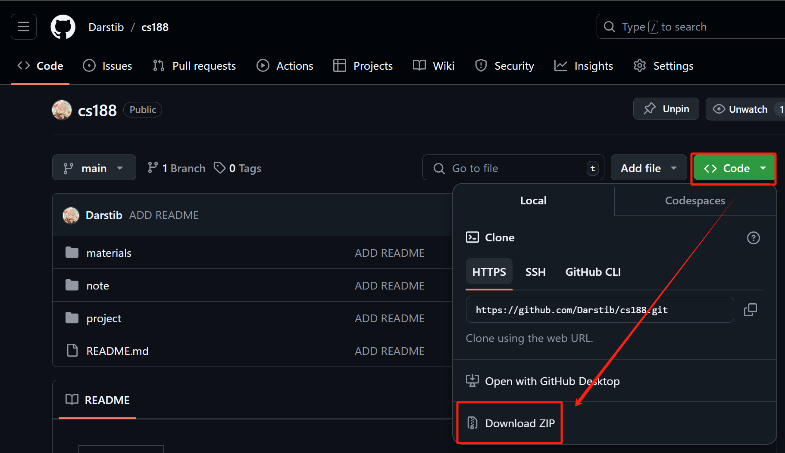

---
tags:
  - notes
  - cs188
comments: true
dg-publish: true
---

# cs188 - sp24

> [中文](README.md) | English

## Introduction

This repository contains notes & self-study materials for UCB [CS 188 Spring 2024](https://inst.eecs.berkeley.edu/~cs188/sp24/); theoretically, all the materials you need to study this course can be found here and in the given external links.

- Notes: The main body is the original course notes[^1], with my own thoughts and typesetting added. You can read these notes on [my blog](https://darstib.github.io/blog/note/CS188/). However, for a better viewing experience, it is recommended to use Obsidian, see Usage-Reading.
- Self-study materials: Since some courses at UCB in recent years have started requiring [CalNet Authentication Service](https://auth.berkeley.edu/cas/login?service=https%3a%2f%2finst.eecs.berkeley.edu%2f%7ecs188%2fsp23%2f), to facilitate future learning, I have archived the materials I believe are necessary for self-study in [this repository](https://github.com/Darstib/cs188). As I am unsure how to apply for reprint permission, if [this project](https://github.com/Darstib/cs188) has a negative impact on the [original course](https://inst.eecs.berkeley.edu/~cs188/sp24/) and its related projects, please [contact me](https://darstib.github.io/blog/connect_me/) to delete it.
- If you are familiar with [search algorithms](https://oi-wiki.org/search/), have a good understanding of ML/DL/RL knowledge, and want to explore some small project files, you can directly work on the projects.

[^1]:  Firstly, I cannot guarantee the correctness of my translation; secondly, webpage/Obsidian reading can already be assisted by many plugins, you can refer to [Reading/Writing Articles](https://darstib.github.io/blog/collection/Tools/#i4); thirdly, my personal energy is limited, and I regret that I cannot fully create a CS188 full Chinese reading environment.

## Table of Contents

### note&project

- Intro
    - [01-Intro_to_AI_Rational_Agents](note/01-Intro_to_AI_Rational_Agents.md)
    - [project-0](project/project-0.md)
- Search
    - [02-State_Spaces_Uninformed_Search](note/02-State_Spaces_Uninformed_Search.md)
    - [03-Informed_Search_Astar_and_Heuristics](note/03-Informed_Search_Astar_and_Heuristics.md)
    - [04-Local_Search](note/04-Local_Search.md)
    - [project-1](project/project-1.md)
- Multi-Agent Search
    - [05-Trees_Minimax_Pruning](note/05-Trees_Minimax_Pruning.md)
    - [06-Expectimax_Monte_Carlo_Tree_Search](note/06-Expectimax_Monte_Carlo_Tree_Search.md)
    - [project-2](project/project-2.md)
- Logic and Classical Planning
    - [07-Propositional_Logic_and_Planning](note/07-Propositional_Logic_and_Planning.md)
    - [08-DPLL&ForwardChaining](note/08-DPLL&ForwardChaining.md)
    - [09-First_Order_Logic](note/09-First_Order_Logic.md)
    - [project-3](project/project-3.md)
- Ghostbusters
    - [10-Intro_to_Probability](note/10-Intro_to_Probability.md)
    - [11-Bayesian_Network_Intro](note/11-Bayesian_Network_Intro.md)
    - [12-Variable_Elimination](note/12-Variable_Elimination.md)
    - [13-Approximate_Inference](note/13-Approximate_Inference.md)
    - [14-Markov_Models](note/14-Markov_Models.md)
    - [15-Hidden_Marko_Models](note/15-Hidden_Marko_Models.md)
    - [16-PF-DN-VPI](note/16-PF-DN-VPI.md)
    - [17-Markov_Decision_Processes](note/17-Markov_Decision_Processes.md)
    - [project-4](project/project-4.md)
- Machine/Reinforcement Learning
    - [18-Iteration](note/18-Iteration.md)
	- [19-Navie_Bayes](note/19-Navie_Bayes.md)
	- [20-Perceptron](note/20-Perceptron.md)
	- [21-Regression](note/21-Regression.md)
	- [22-Neural_Networks](note/22-Neural_Networks.md)
	- [24-Reinforcement_Learnin](note/24-Reinforcement_Learnin.md)
	- project5/6 No explanation
		- project 6 - Q7 code has been completed, but the training results are very poor, and there is nowhere to debug it, so I gave up.

### materials

- course_page
	- Calendar of the course website, convenient for viewing how to self-study;
- disc
	- Relevant discussion questions and their solutions;
- origianl_note
	- Original course notes, theoretically viewing the above personal notes is sufficient;
- project
      - original_zip
          - Original project source code;
    - intro_page
        - Saved page files of the lab documentation.
    - [solution](https://github.com/Darstib/cs188/tree/main/project/solution)
        - Reference code (moved to `cs188/project/solution/`)
- [gradecode](https://www.gradescope.com/)
    - 4VK322.

## Usage

### Download

#### Using git

```shell
git clone https://github.com/Darstib/cs188.git
```

#### Directly Download All



#### Partial Download

If you only want the note or project part or another single folder, you can use [DownGit](https://download-directory.github.io/), enter the URL of the target folder in this git repository.

### Reading

> For a better reading experience from scratch, you can refer to [here](https://darstib.github.io/blog/tutorial/begin/Obsidian_begin/#ii); for a simpler approach, see below:

1. Get [Obsidian](https://obsidian.md);
2. [Import Markdown](https://publish.obsidian.md/help-zh/import/markdown);
3. Click the top-right corner to enter reading view.


