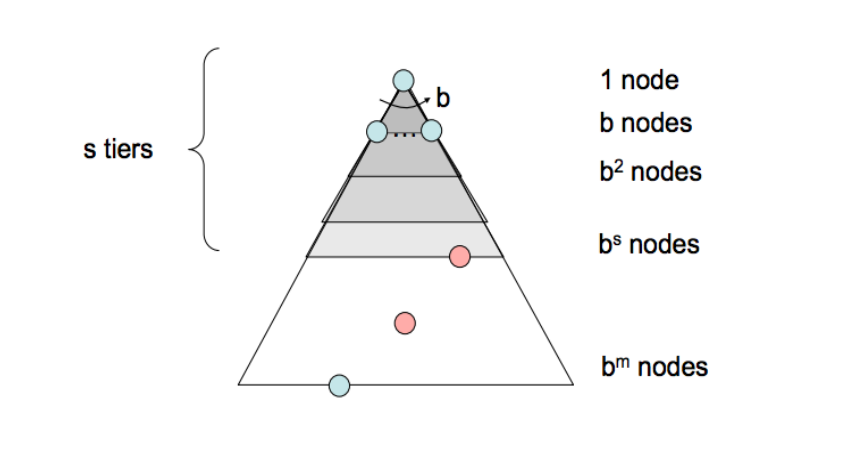

## link

- [cs188-sp24-note02](../materials/original_note/cs188-sp24-note02.pdf)

## note

### State Spaces and Search Problems

> In order to create a rational planning agent, we need a way to <u>mathematically express the given environment in which the agent will exist</u> . To do this, we must formally express a search problem - given our agent’s current state (its configuration within its environment),

A search problem consists of the following elements: 

- A **state space** - The set of all possible states that are possible in your given world 
- A **set of actions** available in each state 
- A **transition model** - Outputs the next state when a specific action is taken at current state 
- An **action cost** - Incurred when moving from one state to another after applying an action 
- A **start state** - The state in which an agent exists initially 
- A **goal test** - A function that takes a state as input, and determines whether it is a goal state

> [!NOTE] a path from the start state to the goal state (typically called a plan)
>
> start state -> state space (using the action and transition and cost methods) -> goal state

> [!NOTE] the difference between a world state, and a search state.
>
>  A _world state_ contains all information about a given state, whereas a _search state_ contains only the information about the world that’s necessary for planning (primarily for space effiency reasons).To illustrate these concepts, we’ll introduce the hallmark motivating example of this course - Pacman. 

The game of Pacman is simple: Pacman must navigate a maze and eat all the (small) food pellets in the maze without being eaten by the malicious patrolling ghosts. If Pacman eats one of the (large) power pellets, he becomes ghost-immune for a set period of time and gains the ability to eat ghosts for points.


### State Space Size

An important question that often comes up while estimating the computational runtime of solving a search problem is **the size of the state space**. This is done almost exclusively with the _fundamental counting principle_, which states that if there are n variable objects in a given world which can take on x1, x2, ..., xn different values respectively, then the total number of states is x1 · x2 · ... · xn.

> [!KNOWLEDGE] _fundamental counting principle_
>
> The fundamental counting principle is a way to determine the total number of possible outcomes in a situation. If you have multiple choices to make, and each choice has a certain number of options, you multiply the number of options for each choice together.
>
> For example, in the Pacman scenario:
> 
> - Pacman has 120 possible positions.
> - Pacman can face 4 directions.
> - There are 2 ghosts, each with 12 possible positions.
> - There are 30 food pellets, each can be either eaten or not (2 options).
>
> So, the total number of possible states is calculated by multiplying these numbers together: $120 \times 4 \times 12 \times 12 \times 2^{30}$
>
> This gives you the total number of different states Pacman can be in.

### State Space Graphs and Search Trees

The final piece of the puzzle is that of state space graphs and search trees.A state space graph[^1] is constructed with states representing nodes, with directed edges existing from a state to its children.

[^1]: 感觉就是有限状态机 (FSM, Finite state machine)。

It’s important to note that <u>in a state space graph, each state is represented exactly once</u>  - there’s simply no need to represent a state multiple times, and knowing this helps quite a bit when trying to reason about search problems.

Though search trees are also a class of graph with states as nodes and actions as edges between states, <u>each state/node encodes not just the state itself, but the entire path (or plan) from the start state to the given state in the state space graph.</u> 


Since there often exist multiple ways to get from one state to another, states tend to show up multiple times in search trees. As a result, search trees are greater than or equal to their corresponding state space graph in size.

We’ve already determined that state space graphs themselves can be enormous in size even for simple problems, and so the question arises - how can we perform useful computation on these structures if they’re too big to represent in memory? The answer lies in how we compute the children of a current state - <u>we only store states we’re immediately working with, and compute new ones on-demand using the corresponding getNextState, getAction, and getActionCost methods.</u> 

### Uninformed Search

<u>The standard protocol for finding a plan to get from the start state to a goal state is to maintain an outer frontier of partial plans derived from the search tree</u> . We continually expand our frontier by removing a node (which is selected using our given strategy) corresponding to a partial plan from the frontier, and replacing it on the frontier with all its children. Removing and replacing an element on the frontier with its children corresponds to discarding a single length n plan and bringing all length (n+1) plans that stem from it into consideration. We continue this until eventually removing a goal state off the frontier, at which point we conclude the partial plan corresponding to the removed goal state is in fact a path to get from the start state to the goal state.

Practically, most implementations of such algorithms will encode information about the parent node, distance to node, and the state inside the node object. This procedure we have just outlined is known as tree search, and the pseudocode for it is presented below:

```python title=" pseudocode for tree search"
function TREE-SEARCH(problem, frontier) return a solution or failure
    frontier ← INSERT(MAKE-NODE(INITIAL-STATE[problem]), frontier)
    while not IS-EMPTY(frontier) do
        node ← POP(frontier)
        if problem.IS-GOAL(node.STATE) then
            return node
        end
        for each child-node in EXPAND(problem, node) do
            add child-node to frontier
        end
    end
    return failure

function EXPAND(problem, node) yields nodes
    s← node.STATE
    for each action in problem.ACTIONS(s) do
        s′ ← problem.RESULT(s, action)
    end
    yield NODE(STATE=s′, PARENT=node, ACTION=action)
```

> [!ATTENTION]
>
> 原笔记中的 pseudocode 长下面这个样子：
> 
> 
> 
> 实话说看着很不习惯，所以我会将其以类 python 的格式写下来

> 很熟悉？确实，往下看。

We’ll now cover three such strategies in succession: **depth-first search, breadth-first search, and uniform cost search.** Along with each strategy, some rudimentary properties of the strategy are presented as well, in terms of the following:

- The completeness of each search strategy - if there exists a solution to the search problem, is the strategy guaranteed to find it given infinite computational resources? 
- The optimality of each search strategy - is the strategy guaranteed to find the lowest cost path to a goal state? 
- The branching factor b - The increase in the number of nodes on the frontier each time a frontier node is dequeued and replaced with its children is O(b). At depth k in the search tree, there exists O(b k ) nodes. 
- The maximum depth m. 
- The depth of the shallowest solution s.

> Depth-First Search & Breadth-First Search 比较常见，这里略过。



> [!INFO]
>
> After we mainly around the several aspects to discuss a search algorithm.
> 
> - **Description**
> - **FrontierRepresentation**
> - **Completeness**
> - **Optimality**
> - **Time Complexity**
> - **Space Complexity** 
>
> In this note, I'll show them in detail; but I'll just give a brief conclusion in later notes.

### Uniform Cost Search

- Description - Uniform cost search (UCS), our last strategy, is a strategy for exploration that **always selects the lowest cost frontier node** from the start node for expansion. 
- Frontier Representation - To represent the frontier for UCS, the choice is usually a **heap-based priority queue**, where the priority for a given enqueued node v is the path cost from the start node to v, or the **backward cost** of v. Intuitively, a priority queue constructed in this manner simply reshuffles itself to maintain the desired ordering by path cost as we remove the current minimum cost path and replace it with its children.
- Completeness - **Uniform cost search is complete**. If a goal state exists, it must have some finite length shortest path; hence, UCS must eventually find this shortest length path. 
- Optimality - UCS is also optimal if we assume all edge costs are nonnegative. By construction, since we explore nodes in order of increasing path cost, we’re guaranteed to find the lowest-cost path to a goal state. The strategy employed in Uniform Cost Search is identical to that of Dijkstra’s algorithm, and the chief difference is that UCS terminates upon finding a solution state instead of finding the shortest path to all states. Note that having negative edge costs in our graph can make nodes on a path have decreasing length, ruining our guarantee of optimality. (See Bellman-Ford algorithm for a slower algorithm that handles this possibility) 
- Time Complexity - Let us define the optimal path cost as $C^∗$ and the minimal cost between two nodes in the state space graph as ε. Then, we must roughly explore all nodes at depths ranging from 1 to $C^∗/ε$, leading to an runtime of O($b^{C^∗/ε}$ ).
- Space Complexity - Roughly, the frontier will contain all nodes at the level of the cheapest solution, so the space complexity of UCS is estimated as O($b^{C^∗/ε}$ ).

> [!TIP]
>
> 这三种搜索策略的主要区别在于他们扩展（使得 path 变长）策略的不同，而体现在编程上就是使用的数据结构不同：
>
> - DFS -> stack
> - BFS -> queue
> - UCS -> (min) heap

> [!PDF|notice] [disc01-regular-sols, p.2](course_notes/CS188%20Introduction%20to%20Artificial%20Intelligence/materials/disc&hw/disc01-regular-sols.pdf#page=2&selection=2,0,2,27&color=notice)
> > Search Algorithms in Action
> 
> 