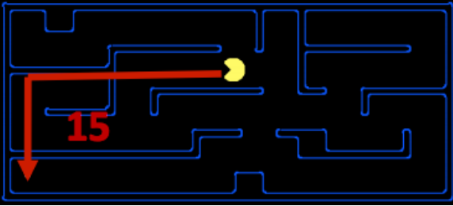
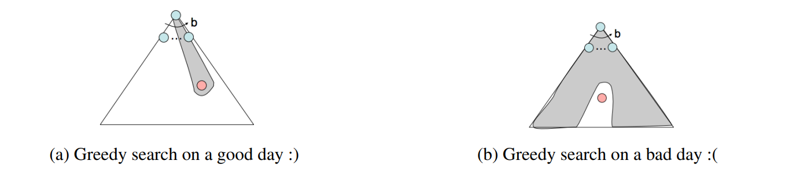
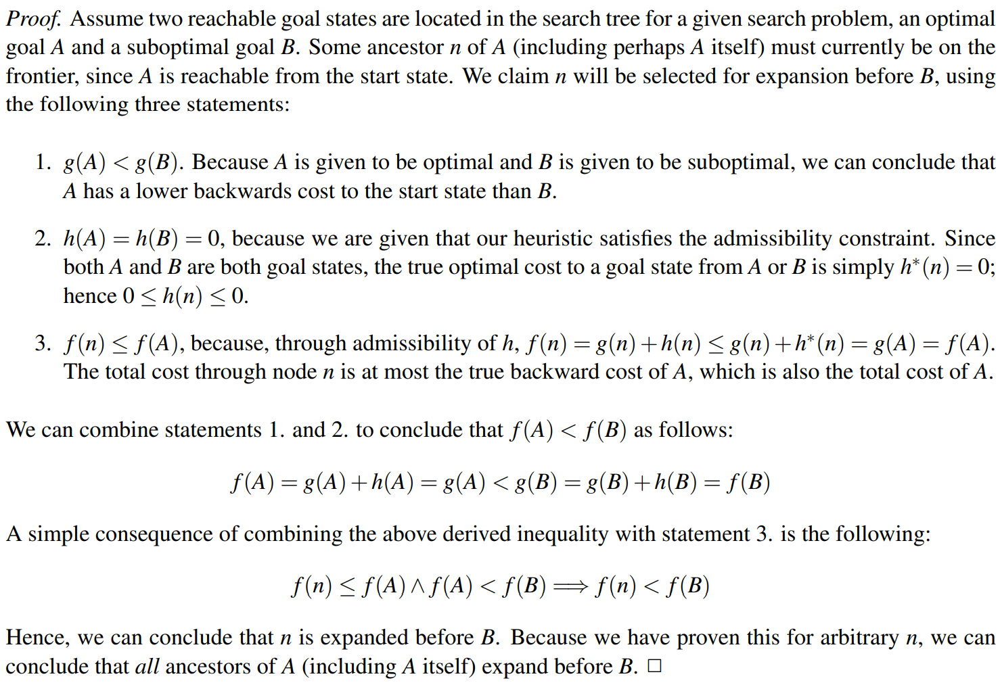
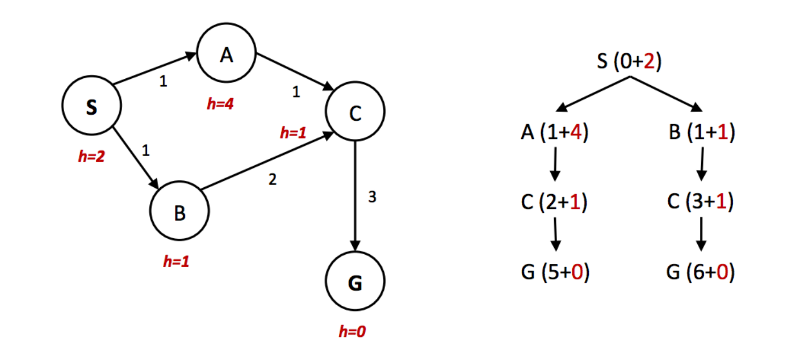
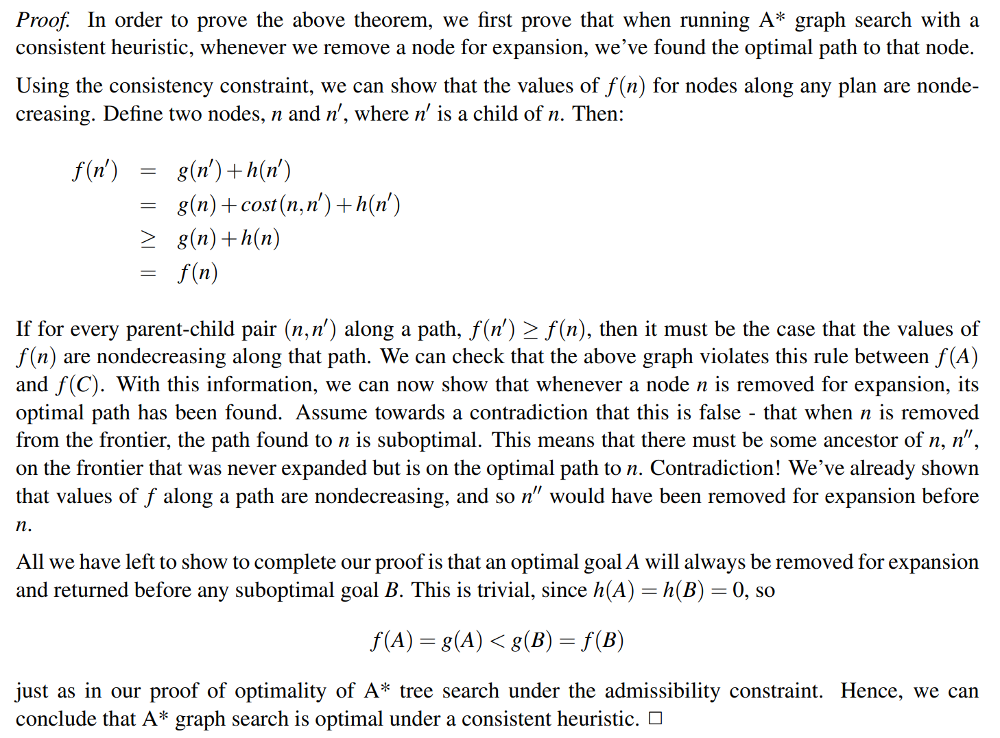

> [!PREREQUISITE]
>
> -  [范数](https://www.wikiwand.com/zh/articles/%E8%8C%83%E6%95%B0)
> - [序关系](https://darstib.github.io/blog/note/cs70/note/18-Misc/#_5)

## note
### Informed Search

_Uniform cost search_ is good because it’s both complete and optimal, but it can be **fairly slow** because it expands in every direction from the start state while searching for a goal. If we <u>have some notion of the direction in which we should focus our search</u> , we can significantly improve performance and "hone in" on a goal **much more quickly**. This is exactly the focus of _informed search_.

### Heuristics（启发式）

Heuristics are the driving force that allow estimation of distance to goal states - they’re functions that <u>take in a state as input and output a corresponding estimate</u>.

> The computation performed by such a function is **specific to the search problem** being solved. For reasons that we’ll see in A* search, below.

we usually want heuristic functions to <u>be a lower bound on this remaining distance to the goal</u> , and so heuristics are typically solutions to **relaxed problems** (where some of the constraints of the original problem have been removed).

Turning to our Pacman example, let’s consider the pathing problem described earlier. A common heuristic that’s used to solve this problem is the **Manhattan distance**, which for two points (x1, y1) and (x2, y2) is defined as: Manhattan(x1, y1, x2, y2) = |x1 −x2|+|y1 −y2|



> [!HELP]
>
> 也就是说，我们先将条件放宽松（在上图中就是先无视墙体）来“试探”着解决 relaxed problem，得到待解决问题的下界。

This concept of preference is very powerful, and is utilized by the following two search algorithms that implement heuristic functions: **greedy search and A*.**

### Greedy Search

- Description - Greedy search is a strategy for exploration that <u>always selects the frontier node with the lowest heuristic value for expansion</u> , which corresponds to the state it believes is nearest to a goal.
- Frontier Representation - Greedy search operates identically to UCS, with a priority queue , while using **estimated forward cost** in the form of heuristic values.
- Completeness and Optimality - Greedy search is not guaranteed to find a goal state if one exists, nor is it optimal, particularly in cases where a very bad heuristic function is selected.



### A* Search

- Description - A* search is a strategy for exploration that <u>always selects the frontier node with the lowest estimated total cost for expansion</u> , where total cost is the entire cost from the start node to the goal node.
- Frontier Representation - Just like greedy search and UCS, A* search also uses a priority queue to represent its frontier. However, A* Search uses **estimated total cost** (= total backward cost + estimated forward cost)
- Completeness and Optimality - A* search is <u>both complete and optimal, given an appropriate heuristic</u>  (which we’ll cover in a minute).

### Admissibility and Consistency

Now, let’s spend some time discussing what constitutes a good heuristic. 

> [!QUESTION]
>
> Why?
> 
> Let’s first reformulate the methods used for determining priority queue ordering in UCS, greedy search, and A* with the following definitions:
>
> - g(n) - The function representing total backwards cost computed by UCS.
> - h(n) - The heuristic value function, or estimated forward cost, used by greedy search.
> - f(n) - The function representing estimated total cost, used by A* search. f(n) = g(n) +h(n).
>
> Indeed, it’s very easy to find heuristics that break these two coveted properties. As an example, consider the heuristic function **h(n) = 1−g(n).** Such a heuristic reduces A* search to BFS.

> [!DEFINITION ]
>
> The condition required for optimality when using A* tree search is known as **admissibility**. The admissibility constraint states that the value estimated by an admissible heuristic is neither negative nor an overestimate, that is: $∀n, 0 ≤ h(n) ≤ h^∗ (n)$, ($h^∗(n)$ is the true optimal forward cost to reach a goal state from a given node n).

> [!THEOREM]
>
> For a given search problem, if the admissibility constraint is satisfied by a heuristic function h, using A* tree search with h on that search problem will yield an optimal solution.
> 
> 

And in case of revisiting the same node multiple times, the natural solution is to simply keep track of which states you’ve already expanded, and never expand them again. Tree search with this added optimization is known as **graph search**, and the pseudocode for it is presented below:

```python title="pseudocode for graph search"
function GRAPH-SEARCH(problem, frontier) return a solution or failure
    reached ← an empty set
    frontier ← INSERT(MAKE-NODE(INITIAL-STATE[problem]), frontier)
    while not IS-EMPTY(frontier) do
        node ← POP(frontier)
        if problem.IS-GOAL(node.STATE) then
            return node
        end
        if node.STATE is not in reached then
            add node.STATE in reached
            for each child-node in EXPAND(problem, node) do
                frontier ← INSERT(child-node, frontier)
            end
        end
    end
    return failure
```

> [!EXAMPLE] Bad example
>
> However, just consider the following simple state space graph and corresponding search tree, annotated with weights and heuristic values:
>
> 
> 
> In the above example, it’s clear that the optimal route is to follow S → A →C → G, yielding a total path cost of 1+1+3 = 5. The only other path to the goal, S → B →C → G has a path cost of 1+2+3 = 6. However, because the heuristic value of node A is so much larger than the heuristic value of node B, node C is first expanded along the second, suboptimal path as a child of node B. It’s then placed into the "reached" set, and so A* graph search fails to reexpand it when it visits it as a child of A, so **it never finds the optimal solution.** Hence, <u>to maintain optimality under A* graph search, we need an even stronger property than admissibility</u>. 

> [!DEFINITION ]
>
> **consistency.** The central idea of consistency is that we enforce not only that a heuristic underestimates the total distance to a goal from any given node, but also the cost/weight of each edge in the graph. The cost of an edge as measured by the heuristic function is simply the difference in heuristic values for two connected nodes. Mathematically, the consistency constraint can be expressed as follows: $∀A,C\quad h(A)−h(C) ≤ cost(A,C)$

> [!THEOREM]
>
> For a given search problem, if the consistency constraint is satisfied by a heuristic function h, using A* graph search with h on that search problem will yield an optimal solution.
>
> 

A couple of important highlights from the discussion above before we proceed: for heuristics that are **either admissible/consistent to be valid**, it must by definition be the case that **h(G) = 0** for any goal state G.

Additionally, <u>Additionally, consistency is not just a stronger constraint than admissibility, consistency implies admissibility. This stems simply from the fact that if no edge costs are overestimates (as guaranteed by consistency), the total estimated cost from any node to a goal will also fail to be an overestimate</u>. This stems simply from the fact that if no edge costs are overestimates (as guaranteed by consistency), the total estimated cost from any node to a goal will also fail to be an overestimate.

> [!HELP]
>
> 简单来说，**admissible** 要求 heuristic function 即 h(n) 低估到达目标的 cost，而 **consitency** 要求 h(n) 低估任意两个 state 之间的 cost 差。在 consitency 中 $h(A)−h(C) ≤ cost(A,C)$，那么对于任意一条 path，将有 $h(A) - h(G)= \sum (h(A)−h(C)) \leq \sum cost(A, C) = h^*(A)$，而 h(G)=0，故 admissible 条件也满足了。
> 
> note3 给出了一个 admissible but inconsitency 的 h(n)，如果没看懂可见原 [note3#p7](https://inst.eecs.berkeley.edu/~cs188/sp24/assets/notes/cs188-sp24-note03.pdf)
> 
> 

### Dominance（优势度）

The standard metric for this(creating "good" heuristics, and how to tell if one heuristic is better than another) is that of **dominance**. If heuristic a is dominant over heuristic b, then the estimated goal distance for a is greater than the estimated goal distance for b for every node in the state space graph. Mathematically, $∀n : h_{a}(n) ≥ h_{b}(n)$ .

> [!INFO]
>
> Additionally, the **trivial heuristic is defined as h(n) = 0**, and using it reduces A* search to UCS. All admissible heuristics dominate the trivial heuristic. The trivial heuristic is often incorporated at the base of a **semi-lattice** for a search problem, a dominance hierarchy of which it is located at the bottom.
> 
>> [!HELP]
>>
>> 关键是理解这个 semi-lattice，用序关系来理解就很不错，下面的例子也很好地帮助我们理解。
> 
> Below is an example of a semi-lattice that incorporates various heuristics ha,hb, and hc ranging from the trivial heuristic at the bottom to the exact goal distance at the top:
>
> 

> 很显然，在 dominance 的度量标准下，所有满足我们先前要求的 heuristics 都“不大于” exact  即正确的情况，那么“越大”的 heuristics 越接近于 exact，自然是我们越想要的。

### Search: Summary

Regarding the search problems, they can be solved using a variety of search techniques, including but not limited to the five we study in CS 188: 

- Breadth-first Search 
- Depth-first Search 
- Uniform Cost Search 
- Greedy Search 
- A* Search

## link

- [cs188-sp24-note03](https://inst.eecs.berkeley.edu/~cs188/sp24/assets/notes/cs188-sp24-note03.pdf)