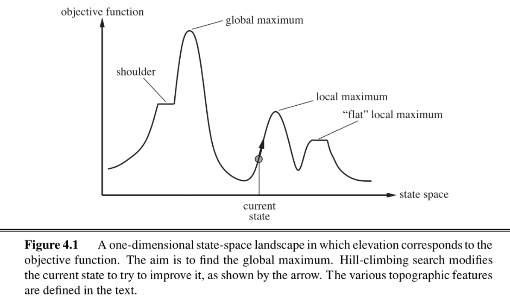
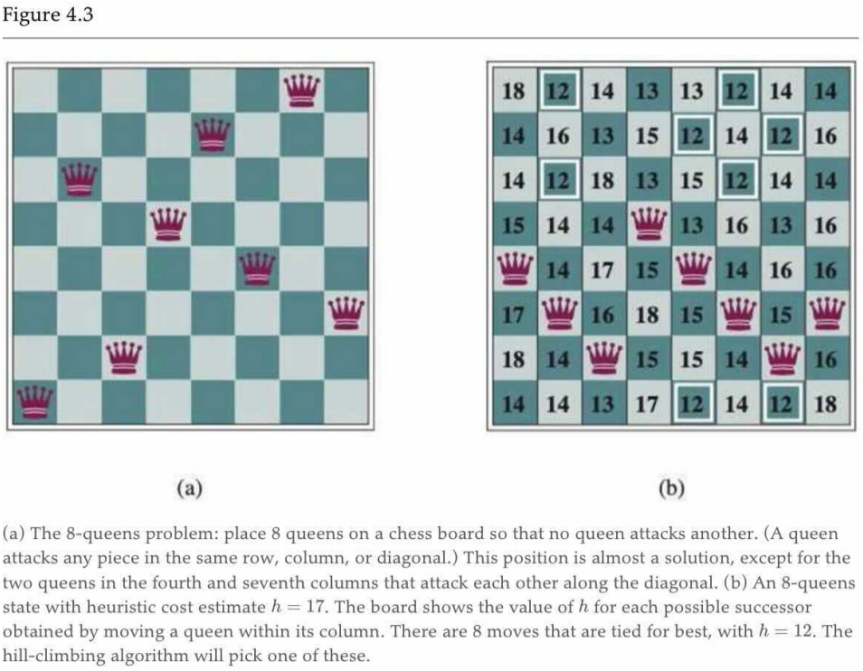
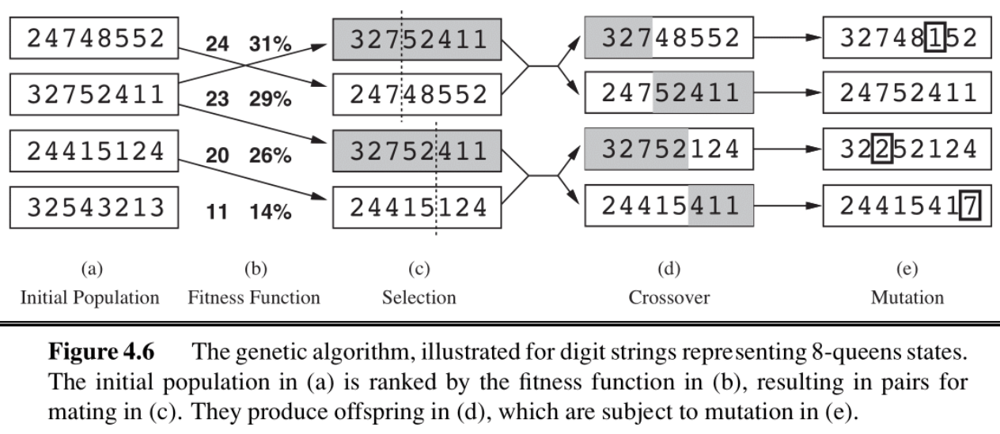
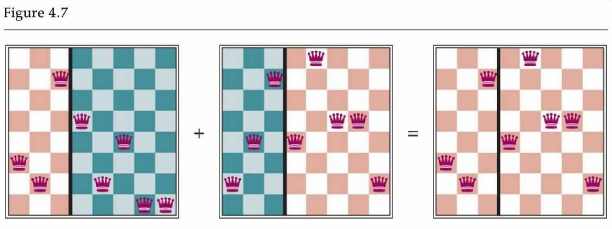

## note

### Local Search

> In the previous note, we wanted to find the goal state, along with the optimal path to get there. But in some problems, we <u>only care about finding the goal state</u>  — reconstructing the path can be trivial.

Local search algorithms allow us to find goal states without worrying about the path to get there.



The figure above shows the one dimensional plot of an objective function on the state space. For that function we wish to find the state that corresponds to the highest objective value. <u>The basic idea of local search algorithms is that from each state they locally move towards states that have a higher objective value until a maximum (hopefully the global) is reached. </u> 

We will be covering four such algorithms, **hill-climbing, simulated annealing, local beam search and genetic algorithms**

### Hill-Climbing Search

> [!DEFINITION]
>
> The **hill-climbing search** algorithm (or _steepest-ascent_) moves from the current state towards the neighboring state that increases the objective value the most.

```python title="pseudocode for hill-climbing"
function HILL-CLIMBING(problem) returns a state
    current <- make-node(problem.initial-state)
    loop do
        neighbor <- a highest-valued successor of current
        if neighbor.value ≤ current.value then
            return current.state
        current <- neighbor
```

The “greediness" of hill-climbing makes it vulnerable to being trapped in local maxima (see figure 4.1), as locally those points appear as global maxima to the algorithm, and plateaus (see figure 4.1). 

Variants of hill-climbing, like **stochastic hill-climbing** which selects an action randomly among the possible uphill moves, have been proposed. 

Another variant, **random sideways moves**, allows moves that don’t strictly increase the objective, allowing the algorithm to escape “shoulders".

Hill-climbing is incomplete. **Random-restart hill-climbing** on the other hand, which conducts a number of hill-climbing searches from randomly chosen initial states, is trivially complete as at some point a randomly chosen initial state can converge to the global maximum.

> [!SUMMARY]
>
> 简单来说，hill-climbing 始终向着目前上升倾向最大的方向；sotchastic hill-climbing 在上升的方向中随机选取一个方向；random sideways moves 则不再拘泥于上升；Random-restart hill-climbing 选择了随机选取多个起点执行 hill-climbing 算法，除去少数极端情况，总能够有一个起点能够到达期望的终点。

### Simulated Annealing Search

**Simulated annealing** aims to combine random walk (randomly moves to nearby states) and hill-climbing to obtain a complete and efficient search algorithm. In simulated annealing we allow moves to states that can <u>decrease the objective.</u> 

The algorithm chooses a random move at each timestep. <u>If the move leads to higher objective value, it is always accepted. If it leads to a smaller objective value, then the move is accepted with some probability</u> . This probability is determined by the temperature parameter, which initially is high (more “bad" moves allowed) and gets decreased according to some “schedule". 

Theoretically, if <u>temperature is decreased slowly enough, the simulated annealing algorithm will reach the global maximum with probability approaching 1.</u> 

```python title="pseudocode for simulated annealing"
function SIMULATED-ANNEALING(problem, schedule) returns a state
    current ← problem.initial-state
    for t = 1 to ∞ do
        T ← schedule(t)
        if T = 0 then return current
        next ← a randomly selected successor of current
        ΔE ← next.value - current.value
        if ΔE > 0 then
            current ← next
        else
            current ← next only with probability e^(ΔE/T)
```

### Local Beam Search

Local beam search is another variant of the hill-climbing search algorithm. The key difference between the two is that <u>local beam search keeps track of k states (threads) at each iteration.</u> 

> [!TIP]
>
> Local Beam 相比于 Hill-Climbing 就是“不在一棵树上吊死”的思路，其同样可以有 stochastic beam search 等变体。

### Genetic Algorithms

Genetic algorithms begin as <u>beam search with k randomly initialized states</u>  called the population. States (called individuals) are represented as a string over a finite alphabet.

> note04 讲的比较啰嗦，但是我觉得先大致看懂伪代码，再结合下面的例子即可。

```python title="pseudocode for genetic algorithm"
function GENETIC-ALGORITHM(population, FITNESS-FN) returns an individual
    inputs: population, a set of individuals
            FITNESS-FN, a function that measures the fitness of an individual
    repeat # 反复“繁衍、进化”，直到子代适应性足够强，或者时间足够长
        new_population ← empty set # 初始化新生代为空集
        for i = 1 to SIZE(population) do # 使子代与父代数相同
            # 基于适应度选择 x/y，适应度越高，选中可能性越大
            x ← RANDOM-SELECTION(population, FITNESS-FN) 
            y ← RANDOM-SELECTION(population, FITNESS-FN)
            child ← REPRODUCE(x, y) # “繁育”子代
            if (small random probability) then #小概率情况下 
                child ← MUTATE(child) # 子代突变
            add child to new_population # 将子代纳入新生代
        population ← new_population # 换代
    until some individual is fit enough, or enough time has elapsed
    return the best individual in population, according to FITNESS-FN

function REPRODUCE(x, y) returns an individual
    inputs: x, y, parent individuals # x/y 为父代
    n ← LENGTH(x); c ← random number from 1 to n # 随机取一个断点 c，交换片段
    return APPEND(SUBSTRING(x, 1, c), SUBSTRING(y, c + 1, n))
```

> 上图中映照伪代码，向我们展示了遗传算法是如何“传宗接代”的；需要注意的是，在 (b) 中有两列数字，第一列表示其 FITNESS，第二列表示其选中为“父代”的概率，这个概率与 FITNESS 线性相关。

> [!EXAMPLE] 8-Queens problem
>
> 





### Summary

In this note, we discussed local search algorithms and their motivation. <u>We can use these approaches when we don’t care about the path to some goal state, and want to satisfy constraints or optimize some objective.</u>  Local search approaches allow us to save space and find adequate solutions when working in large state spaces!

## link

- [cs188-sp24-note04](../materials/original_note/cs188-sp24-note04.pdf)