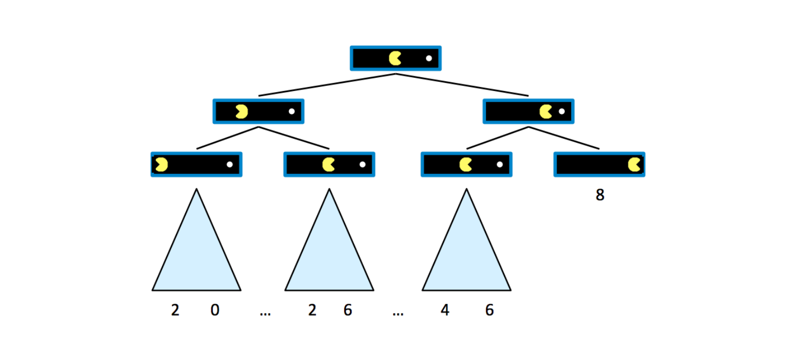
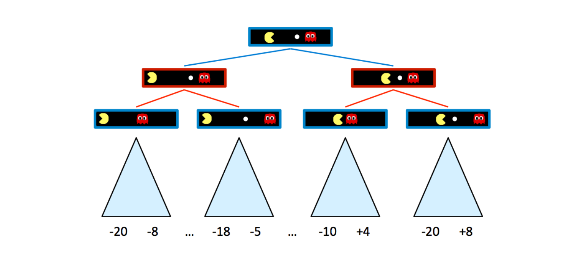
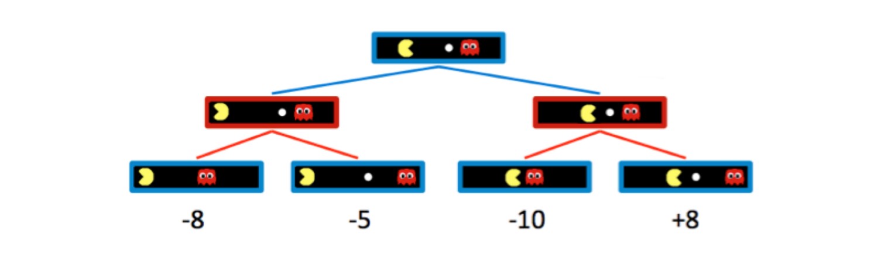
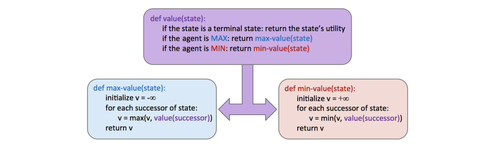
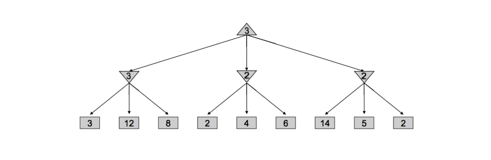
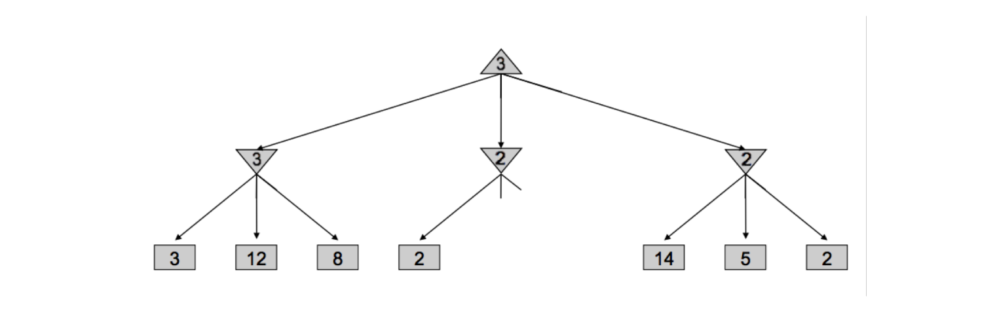
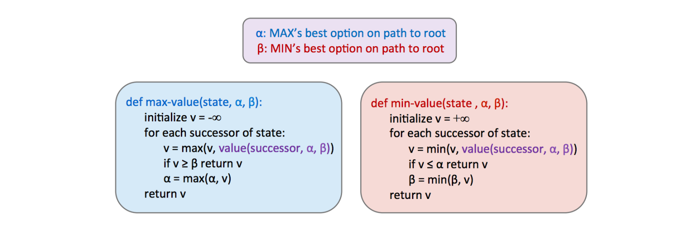

## note

### Games

In the notes before, our agents could determine the best possible plan and then simply execute it to arrive at a goal. 

Now, let’s shift gears and consider scenarios where <u>our agents have one or more adversaries who attempt to keep them from reaching their goal(s).</u>

We’ll need to run a new class of algorithms that yield solutions to **adversarial search problems**, more commonly known as **games**.

There are many different types of games. Games can have actions with either deterministic or stochastic (probabilistic) outcomes, can have any variable number of players, and may or may not be zero-sum[^1].

[^1]: In a zero-sum game, one player's gain is exactly equal to the other player's loss. If one player wins points, the other loses the same amount. The total "sum" of gains and losses is zero.

The first class of games we’ll cover are **deterministic zero-sum games**, games where actions are deterministic and our gain is directly equivalent to our opponent’s loss and vice versa.

> [!EXAMPLE]-
>
> The easiest way to think about such games is as being defined by a single variable value, which one team or agent tries to maximize and the opposing team or agent tries to minimize, effectively putting them in direct competition. In Pacman, this variable is your score, which you try to maximize by eating pellets quickly and efficiently while ghosts try to minimize by eating you first. Many common household games also fall under this class of games:
> 
> - Checkers
> - Chess
> - Go

As opposed to normal search, which returned a comprehensive plan, adversarial search <u>returns a strategy, or policy, which simply recommends the best possible move</u>  given some configuration of our agent(s) and their adversaries.

> [!NOTE]
>
> The standard game formulation consists of the following definitions: 
> 
> - Initial state, $s_{0}$
> - Players, Players(s) denote whose turn is 
> - Actions, Actions(s) available actions for the player 
> - Transition model Result(s,a) 
> - Terminal test, Terminal−test(s) 
> - Terminal values, Utility(s, player)

### Minimax

> [!DEFINITION]
>
> The first zero-sum-game algorithm we will consider is **minimax**, which runs under the motivating assumption that the opponent we face <u>behaves optimally, and will always perform the move that is worst for us</u> .

To introduce this algorithm, we must first formalize the notion of terminal utilities and state value. The value of a state is the optimal score attainable by the agent which controls that state.

- A **state’s value** is defined as the <u>best possible outcome (utility)</u>  an agent can achieve from that state[^2].
- The value of a **terminal state**, called a terminal utility, is always some <u>deterministic known value and an inherent game property</u> .
- In this example, the value of a **non-terminal state** is defined as the maximum of the values of its children.

[^2]: We’ll formalize the concept of utility more concretely later, but for now it’s enough to simply think of an agent’s utility as its score or number of points it attains.

> [!NOTE]
>
> Defining V(s) as the function defining the value of a state s, we can summarize the above discussion:
> 
> $$ V(s) = \begin{cases} \max\limits_{s' \in \text{successors}(s)} V(s'), & \text{if } s \text{ is a non-terminal state} \\ \text{\quad \quad known}, & \text{if } s \text{ is a terminal state} \end{cases} $$

> [!EXAMPLE] Case 1
>
> Assume that Pacman starts with 10 points and loses 1 point per move until he eats the pellet, at which point the game arrives at a terminal state and ends. 
>
> 
> 
> We can start building a game tree for this board as follows, where children of a state are successor states just as in search trees for normal search problems:
> 
> 
> 
> Since the value of the root node’s direct right child will be 8, and the root node’s direct left child will be 6, it follows that by running such computation, an agent can determine that it’s optimal to move right.

> [!EXAMPLE] Case 2
>
> Let’s now introduce a new game board with an adversarial ghost that wants to keep Pacman from eating the pellet.
> 
> 
>
> The rules of the game dictate that the two agents take turns making moves, leading to a game tree where the two agents switch off on layers of the tree that they "control". Here’s the game tree that arises from the new two-agent game board above:
>
> 
> 
> Blue nodes correspond to nodes that Pacman controls and can decide what action to take, while red nodes correspond to ghost-controlled nodes.

Naturally, adding ghost-controlled nodes changes the move Pacman believes to be optimal, and the new optimal move is determined with the minimax algorithm. Instead of maximizing the utility over children at every level of the tree, <u>the minimax algorithm only maximizes over the children of nodes controlled by Pacman, while minimizing over the children of nodes controlled by ghosts.</u> 

> [!EXAMPLE]
>
> For simplicity purposes, let’s truncate this game tree to a depth-2 tree, and assign spoofed values to terminal states as follows:
> 
> 
> 
> Hence, the two ghost nodes above have values of min(−8,−5) = −8 and min(−10,+8) = −10 respectively. Correspondingly, the root node controlled by Pacman has a value of max(−8,−10) = −8. 
> 
> Since Pacman wants to maximize his score, he’ll go left and take the score of −8 rather than trying to go for the pellet and scoring −10.
>
> In order to act optimally, Pacman is forced to hedge his bets and counterintuitively move away from the pellet to minimize the magnitude of his defeat.

> [!NOTE]
>
> We can summarize the way minimax assigns values to states as follows:
> 
> $$V(s) = 
\begin{cases} 
\max \limits_{s' \in \text{successors}(s)} V(s') & \text{if } s \text{ is an agent-controlled state} \\ 
\min \limits_{s' \in \text{successors}(s)} V(s') & \text{if } s \text{ is an opponent-controlled state} \\ 
\text{\quad \quad known} & \text{if } s \text{ is a terminal state} 
\end{cases}$$

In implementation, minimax behaves similarly to **depth-first search**, computing values of nodes in the same order as DFS would, starting with the the leftmost terminal node and iteratively working its way rightwards. More precisely, it performs a **postorder traversal** of the game tree. 

**The resulting pseudocode for minimax** is both elegant and intuitively simple, and is presented below. Note that minimax will return an action, which corresponds to the root node’s branch to the child it has taken its value from.

### Alpha-Beta Pruning

Minimax seems just about perfect - it’s simple, it’s optimal, and it’s intuitive. Yet, its execution is very similar to depth-first search and it’s time complexity is identical, a dismal O(b m). 

> Recalling that b is the branching factor and m is the approximate tree depth at which terminal nodes can be found, this yields far too great a runtime for many games. For example, chess has a branching factor b ≈ 35 and tree depth m ≈ 100. 

To help mitigate this issue, minimax has an optimization - **alpha-beta pruning**.

> [!DEFINITION]
>
> Conceptually, **alpha-beta pruning** is this: if you’re trying to determine the value of a node n by looking at its successors, stop looking as soon as you know that n’s value can at best equal the optimal value of n’s parent.

Consider the following game tree, with square nodes corresponding to terminal states, downward-pointing triangles corresponding to minimizing nodes, and upward-pointing triangles corresponding to maximizer nodes:

> [!TIP]
>
> 可以理解为：方形值为既定值，下三角（姑且允许我这么称呼“downward-pointing triangles”）“向下”取其子代值，上三角则“向上”却子代值。
> 
> （假使我们称深度为 n 的节点为 “n 代”，第 m 个子代为“m 号”，其值为 $V_{nm}$）
> 
> 可以发现：首先，我们获得了 1 代 1 号的 “3” ；然后我们在尝试获取 1 代 2 号时，先看到了 2 代 4 号的 “2”，这说明 $V_{12} \leq 2 < V_{11}$；换言之，无论 1 代 2 号的其余子代是什么，他都无法影响到 0 代；故“剪枝”。

Implementing such pruning can reduce our runtime to as good as $O(b^{m/2} )$, effectively doubling our "solvable" depth. This pruning is exactly what the minimax algorithm with alpha-beta pruning does, and is implemented as follows:

> [!USELESS]
>
> note05 让我们 "Take some time to compare this with the pseudocode for vanilla minimax"。
> 
> 嗯？“香草”？还去搜了下 "vanilla minimax" 是什么……
> 
> 查[牛津字典](https://www.oxfordlearnersdictionaries.com/definition/english/vanilla_2)得知其还有 "ordinary; not special in any way" 之意；也就是说，我们前面不剪枝的就是 vanilla minimax 。

### Evaluation Functions

Though alpha-beta pruning can help increase the depth for which we can feasibly run minimax, this still usually isn’t even close to good enough to get to the bottom of search trees for a large majority of games. As a result, we turn to **evaluation functions**, <u>functions that take in a state and output an estimate of the true minimax value of that node</u>. Typically, this is plainly interpreted as "better" states being assigned higher values by a good evaluation function than "worse" states. Evaluation functions are widely employed in depth-limited minimax, where we treat non-terminal nodes located at our maximum solvable depth as terminal nodes, giving them mock terminal utilities as determined by a carefully selected evaluation function. Because evaluation functions can only yield estimates of the values of non-terminal utilities, this removes the guarantee of optimal play when running minimax.

> [!SUMMARY]
>
> 有些情况剪枝后依旧难以计算 => 强行截断 game tree，其最底层的 non-terminal states 由 evaluate function 赋予其 known 而变为 terminal states => 降低了树的深度和其可靠性。

A lot of thought and experimentation is typically put into the selection of an evaluation function when designing an agent that runs minimax, and the better the evaluation function is, the closer the agent will come to behaving optimally. <u>Additionally, going deeper into the tree before using an evaluation function also tends to give us better results</u>  - burying their computation deeper in the game tree mitigates the compromising of optimality.

The most common design for an evaluation function is a **linear combination of features**: $Eval(s) = w_{1} f_{1}(s) +w_{2} f_{2}(s) +...+w_{n} f_{n}(s)$ [^3].

[^3]: Each $f_{i}(s)$ corresponds to a **feature** extracted from the input state s, and each feature is assigned a corresponding **weight** $w_{i}$ .

Features are simply some element of a game state that we can extract and assign a numerical value. 

> [!EXAMPLE]
>
> In a game of checkers we might construct an evaluation function with 4 features: number of agent pawns, number of agent kings, number of opponent pawns, and number of opponent kings. We’d then select appropriate weights based loosely on their importance. In our checkers example, it makes most sense to select positive weights for our agent’s pawns/kings and negative weights for our opponents pawns/kings. Furthermore, we might decide that since kings are more valuable pieces in checkers than pawns, the features corresponding to our agent’s/opponent’s kings deserve weights with greater magnitude than the features concerning pawns. Below is a possible evaluation function that conforms to the features and weights we’ve just brainstormed:
>
> $Eval(s) = 2 · agent\_kings(s) +agent\_pawns(s)−2 · opponent\_kings(s)−opponent\_pawns(s)$

As you can tell, evaluation function design can be quite free-form, and don’t necessarily have to be linear functions either. For example nonlinear evaluation functions based on neural networks are very common in Reinforcement Learning applications. The most important thing to keep in mind is that the evaluation function yields higher scores for better positions as frequently as possible. This may require a lot of finetuning and experimenting on the performance of agents using evaluation functions with a multitude of different features and weights.

> [!TIP]
>
> 回想一下高中学习的线性回归：我们根据已知数据，获取 $\hat{y} = ax+b$，然后碰到了一个前面所不知道的 x，代入其中，我们依旧能够获取 $\hat{y} ≈ y$，这就是一个 eval(x)。

## link

- [cs188-sp24-note05](https://inst.eecs.berkeley.edu/~cs188/sp24/assets/notes/cs188-sp24-note05.pdf)