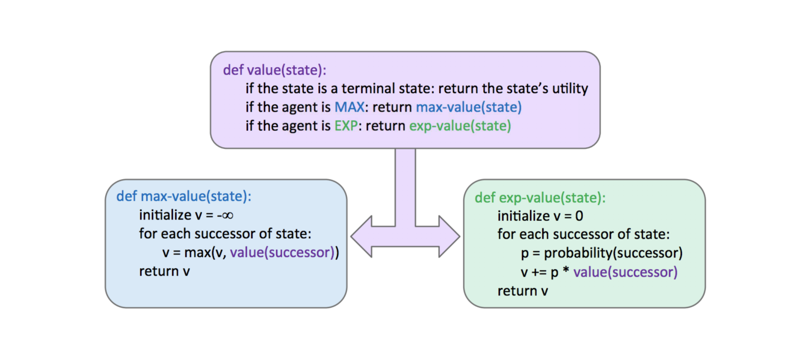
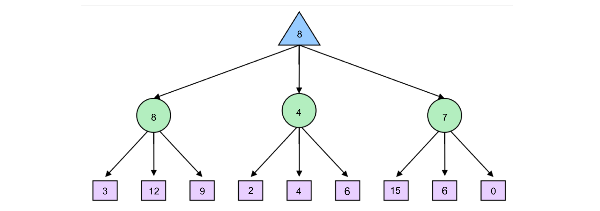
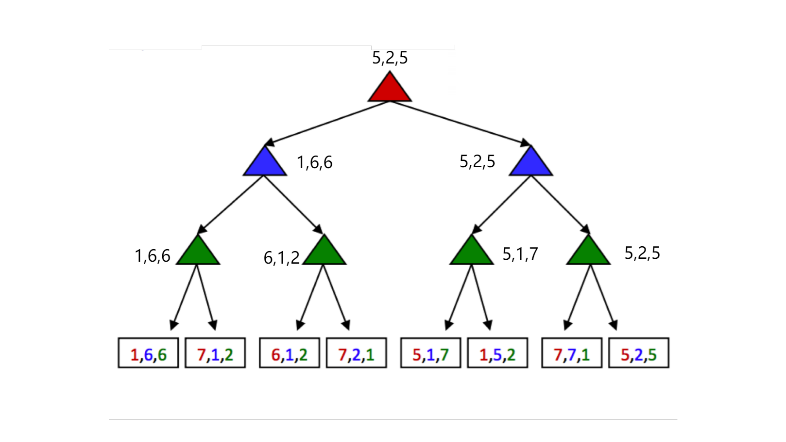
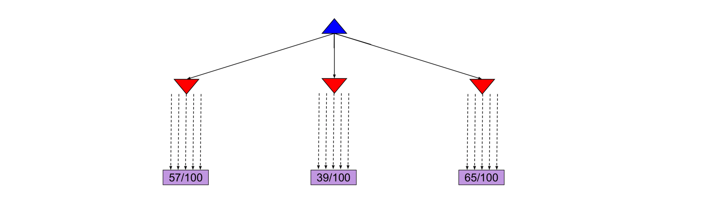
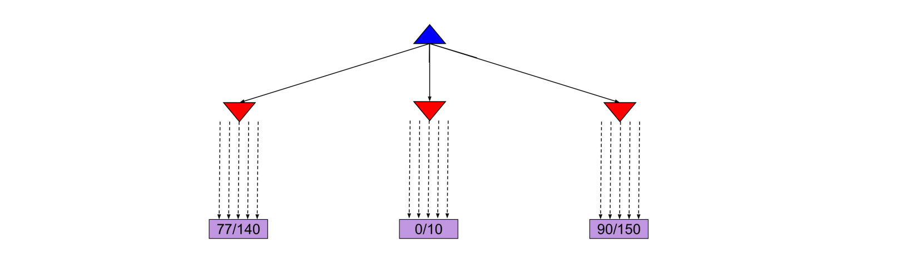
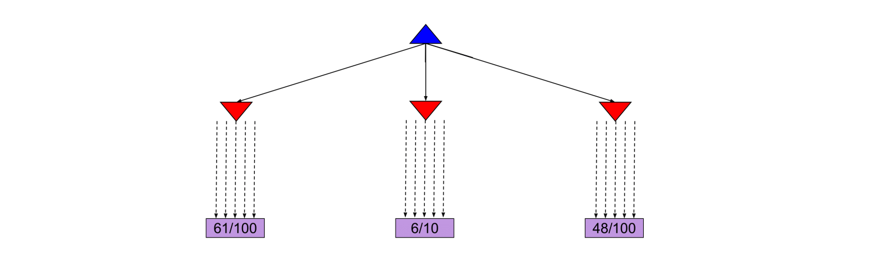

---
tags:
  - notes
  - cs188
comments: true
dg-publish: true
---

## note

### Expectimax

Because minimax believes it is responding to an optimal opponent, it’s often overly pessimistic in situations where optimal responses to an agent’s actions are not guaranteed. Such situations include scenarios with inherent randomness such as card or dice games or unpredictable opponents that move randomly or suboptimally. This randomness can be represented through a generalization of minimax known as **expectimax**.

Expectimax introduces **chance nodes** into the game tree, which instead of considering the worst case scenario as minimizer nodes do, considers the **average case**. More specifically, while minimizers simply compute the minimum utility over their children, chance nodes compute the expected utility or expected value.

> [!NOTE]
>
> Our rule for determining values of nodes with **expectimax** is as follows:[^1]
> 
> $$V(s) = 
\begin{cases} 
\max \limits_{s' \in \text{successors}(s)} V(s') & \text{if } s \text{ is an agent-controlled state} \\ 
\sum \limits_{s' \in \text{successors}(s)} p(s'|s)V(s') & \text{if } s \text{ is a chance state} \\ 
\text{\quad \quad known} & \text{if } s \text{ is a terminal state} 
\end{cases}$$

[^1]: In the below formulation, p(s′ |s) refers to either the probability that a given nondeterministic action results in moving from state s to s′ , or the probability that an opponent chooses an action that results in moving from state s to s′ , depending on the specifics of the game and the game tree under consideration.

From this definition, we can see that <u>minimax is simply a special case of expectimax</u> . Minimizer nodes are simply chance nodes that assign a probability of 1 to their lowest-value child and probability 0 to all other children.

The pseudocode for expectimax is quite similar to minimax, since we’re replacing minimizing nodes with chance nodes:

> [!EXAMPLE]
>
> Consider the following expectimax tree, where chance nodes are represented by circular nodes instead of the upward/downward facing triangles for maximizers/minimizers.
> 
> Assume for simplicity that all children of each chance node have a probability of occurrence of 1/3 .
>
> 

### Mixed Layer Types

Though minimax and expectimax call for alternating maximizer/minimizer nodes and maximizer/chance nodes respectively, many games still don’t follow the exact pattern of alternation that these two algorithms mandate. 

Even in Pacman, after Pacman moves, there are usually multiple ghosts that take turns making moves, not a single ghost. We can account for this by very <u>fluidly adding layers into our game trees</u>  as necessary. 

In the Pacman example for a game with four ghosts, this can be done by having a maximizer layer followed by 4 consecutive ghost/minimizer layers before the second Pacman/maximizer layer. 

In fact, doing so inherently gives rise to cooperation across all minimizers, as they alternatively take turns further minimizing the utility attainable by the maximizer(s). It’s even possible to combine chance node layers with both minimizers and maximizers. 

If we have a game of Pacman with two ghosts, where one ghost behaves randomly and the other behaves optimally, we could simulate this with alternating groups of maximizerchance-minimizer nodes.

### General Games

Not all games are zero-sum. Indeed, different agents may have have distinct tasks in a game that don’t directly involve strictly competing with one another. Such games can be set up with trees characterized by **multi-agent utilities**.

Such utilities, rather than being a single value that alternating agents try to minimize or maximize, are represented as tuples with different values within the tuple corresponding to unique utilities for different agents. <u>Each agent then attempts to maximize their own utility at each node they control, ignoring the utilities of other agents</u> .

> [!EXAMPLE]
>
> 
>
>> [!HELP]
>>
>> 每层 agent 对应 utility tuples 中相同颜色的数字；在经过该层时，它们只考虑与他们有关的数字；对于 maximizer，既是取其最大者。
>> 

### Monte Carlo Tree Search

For applications with a large branching factor, like playing Go, minimax can no longer be used. For such applications we use the **Monte Carlo Tree Search (MCTS)** algorithm. 

MCTS is based on two ideas:

- **Evaluation by rollouts**: From state s play many times using a policy (e.g. random) and count wins/losses.
- **Selective search**: explore parts of the tree, without constraints on the horizon, that will improve decision at the root.

In the Go example, from a given state, we play until termination according to a policy multiple times. We record **the fraction of wins**, which correlates well with the value of the state[^2].

> [!EXAMPLE]
>
> From the current state we have three different available actions (left, middle and right). We take each action 100 times and we record the percentage of wins for each one.
>
> 
>
> After the simulations, we are fairly confident that the right action is the best one. 
> 
> In this scenario, we allocated the same amount of simulations to each alternative action. However, it might become clear after a few simulations that a certain action does not return many wins and thus we might choose to allocate this computational effort in doing more simulations for the other actions.
> 
> 
>
> An interesting case arises when some actions yield similar percentages of wins but one of them has used much fewer simulations to estimate that percentage, as shown in the next figure. 
> 
> 
> 
> In this case the estimate of the action that used fewer simulations will have higher variance and hence we might want to allocate a few more simulations to that action to be more confident about the true percentage of wins.

[^2]: the value of the state 越大，在该决策下的模拟胜利可能性（即下图中的 x/y）也就越大。

> [!INFO]
>
> The **UCB algorithm** captures this trade-off between “promising" and “uncertain’ actions by using the following criterion at each node n:[^3]
>
> [^3]: where N(n) denotes the total number of rollouts from node n and U(n) the total number of wins for Player(Parent(n)).
>
>  $$UCB1(n)=\frac{U(n)}{N(n)}+C\times\sqrt{\frac{\log N(PARENT(n))}{N(n)}}$$
>
> The first term captures how promising the node is, while the second captures how uncertain we are about that node’s utility. The user-specified parameter C balances the weight we put in the two terms (“exploration" and “exploitation") and depends on the application and perhaps the stage of the task (in later stages when we have accumulated many trials, we would probably explore less and exploit more).
>
>> [!HELP]
>>
>> 我们暂时不必理解这个公式是如何计算以及为什么这么计算；明白这个算法帮助我们决定是要 "explore new moves (exploration) or use moves that have worked well in the past (exploitation)" 即可。
>> 
>> > 在前期学习过程中，这些算法都是“函数”，我们只需要知道其“输入-功能-输出”就好了。

The **MCTS UCT algorithm** uses the UCB criterion in tree search problems. More specifically, it repeats the following three steps multiple times:

1. The UCB criterion is used to move down the layers of a tree from the root node until an unexpanded leaf node is reached.
2. A new child is added to that leaf, and we run a rollout from that child to determine the number of wins from that node.
3. We update the numbers of wins from the child back up to the root node.

Once the above three steps are sufficiently repeated, we choose the action that leads to the child with the highest N. 

> Note that because UCT inherently explores more promising children a higher number of times, as N → ∞, UCT approaches the behavior of a minimax agent.

### Summary

In this note, we shifted gears from considering standard search problems where we simply attempt to find a path from our starting point to some goal, to considering adversarial search problems where we may have opponents that attempt to hinder us from reaching our goal.

- **Minimax** - Used when our opponent(s) behaves optimally, and can be optimized using **α-β pruning**. Minimax provides more conservative actions than expectimax, and so tends to yield favorable results when the opponent is unknown as well.
- **Expectimax** - Used when we facing a suboptimal opponent(s), using a **probability distribution** over the moves we believe they will make to compute the expectated value of states.
- In most cases, it’s too computationally expensive to run the above algorithms all the way to the level of terminal nodes in the game tree under consideration, and so we introduced the notion of **evaluation functions** for early termination. 
- For problems with large branching factors we described the **MCTS and UCT algorithms**. Such algorithms are <u>easily parallelizable, allowing for a large number of rollouts to take place using modern hardware</u>.
- We considered the problem of general games with multi-agent, where the rules are not necessarily zero-sum.

## link

- [cs188-sp24-note06](https://inst.eecs.berkeley.edu/~cs188/sp24/assets/notes/cs188-sp24-note06.pdf)
