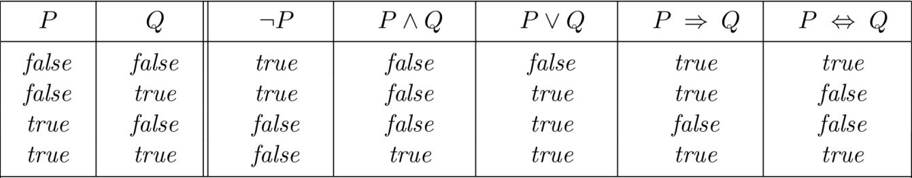
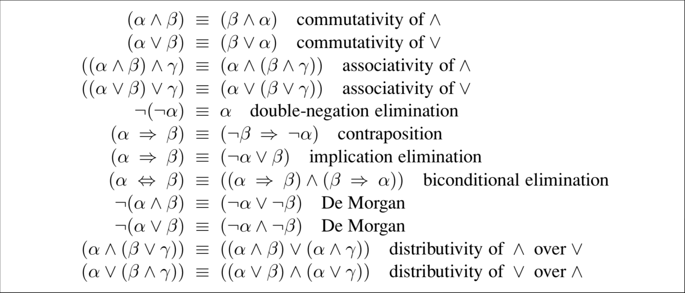
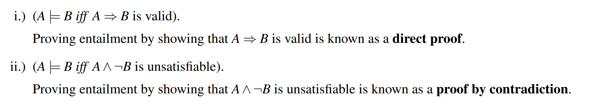

---
tags:
  - notes
  - cs188
comments: true
dg-publish: true
---

## note
### A Knowledge Based Agent

Imagine a dangerous world filled with lava, the only respite a far away oasis. We would like our agent to be able to safely navigate from its current position to the oasis.

> In reinforcement learning, we assume that the only guidance we can give is a reward function which will try to nudge the agent in the right direction, like a game of ’hot or cold’. 
> 
> However, we might consider an alternative strategy, instead.

Let’s tell the agent some facts about the world and allow it to reason about what to do based on the information at hand.

This alternative type of agent is known as a **knowledge based agent**. Such an agent maintains a knowledge base, which is <u>a collection of logical sentences that encodes what we have told the agent and what it has observed</u> . The agent is also able to perform logical inference to draw new conclusions.

### The Language of Logic

> 在[cs70](https://darstib.github.io/blog/note/cs70/01-Propositional_Logic/) 中我们已经学习了解过了，这里简单回顾一下。

1. **Conjunction（合取）**: P∧Q (“P and Q”). True only when both P and Q are true.	
	- conjunctive normal form or CNF[^1]
2. **Disjunction（析取）**: P∨Q (“P or Q”). True when at least one of P and Q is true.
3. **Negation（取反 / 否）**: ¬P (“not P”). True when P is false.
4. **Implication（蕴涵词）**: P ⇒ Q (“P implies Q”). This is the same as “If P, then Q.”
5. **two-way implication** or **biconditional** : p↔q.
6. **quantifiers（量词）**: The universal quantifier ∀ (“for all”) and the existential quantifier ∃ (“there exists”).

[^1]: **CNF** is a conjunction of **clauses**, each of which a disjunction of literals. It has the general form (P1 ∨ ··· ∨Pi)∧ ··· ∧ (Pj ∨··· ∨Pn), i.e. it is an **‘AND’ of ‘OR’s**.

## link

- [cs188-sp24-note07](https://inst.eecs.berkeley.edu/~cs188/sp24/assets/notes/cs188-sp24-note07.pdf)