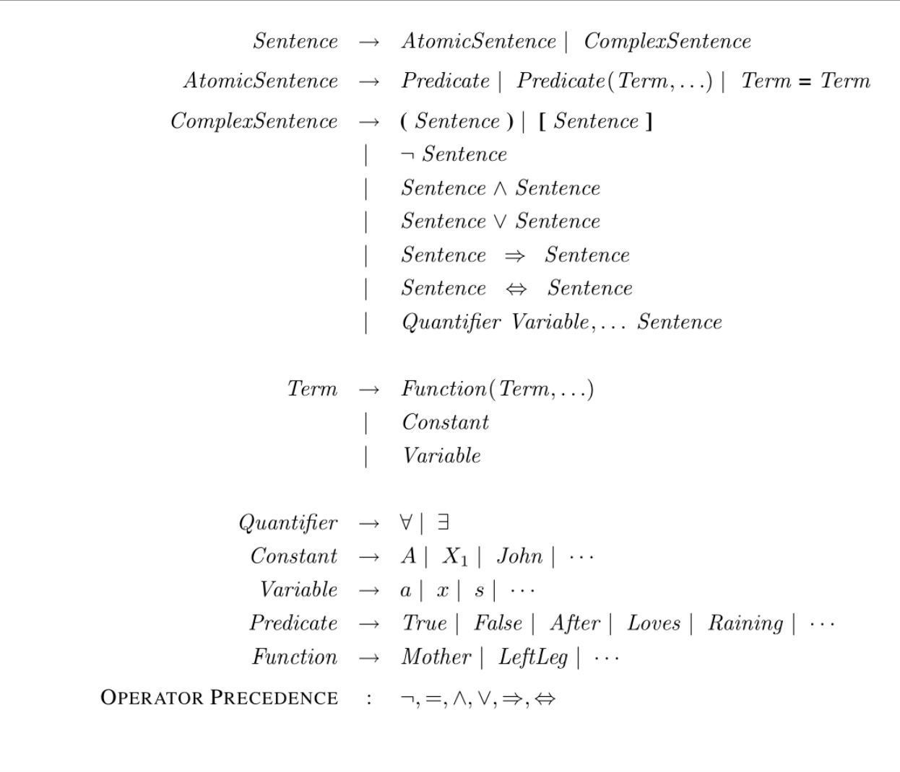

---
tags:
  - notes
comments: true
dg-publish: true
---

> [!PREREQUISITE]
>
> - [cs70-Propositional_Logic](https://darstib.github.io/blog/note/cs70/01-Propositional_Logic/)

## note
### First-Order Logic

The second dialect of logic, **first-order logic (FOL)**, is more expressive than propositional logic and uses objects as its basic components. With first-order logic we can describe relationships between objects and apply functions to them. <u>Each object is represented by a constant symbol, each relationship by a predicate symbol, and each function by a function symbol.</u> 

> [!NOTE]
>
> - **Terms** in first-order logic are logical expressions that refer to an object. The simplest form of terms are constant symbols. However we don’t want to define distinct constant symbols for every possible object.[^1]
> - **Atomic sentences** in first-order logic are descriptions of relationships between objects, and are true if the relationship holds.[^2]
> - **Complex sentences** of first order logic are analogous to those in propositional logic and are <u>atomic sentences connected by logical connectives</u>.
> - **Quantifiers**: The **universal quantifier ∀**, has the meaning “for all,” and the **existential quantifier ∃,**, has the meaning “there exists.”
> - **Equality symbol**: signify that two symbols refer to the same object.[^3]

[^1]: For example, if we want to refer to John’s left leg and Richard’s left leg, we can do so by using function symbols like **Leftleg(John)** and **Leftleg(Richard)**. Function symbols are just another way to name objects and are not actual functions.
[^2]: An example of an atomic sentence is **Brother(John,Richard)** which is formed by a predicate symbol followed by a list of terms inside the parentheses.
[^3]: For example, the incredible sentence （不懂的可以自行了解 Einstein）(Wife(Einstein)=FirstCousin(Einstein)∧Wife(Einstein)=SecondCousin(Einstein)) is true. 

> [!TIP] 
>
> With propositional logic, we model our world as a set of symbols that are true or false. Under this assumption, we can <u>represent a possible world as a vector, with a 1 or 0 for every symbol.</u>
> 
> - This binary view of the world is what is known as a **factored representation**. With first-order logic, our world consists of objects that relate to one another. 
> - This second object-oriented view of the world is known as a **structured representation**, is in many ways more expressive and is more closely aligned with the language we naturally use to speak about the world.

The following table summarizes the first order logic syntax:

### First Order Logical Inference

With first order logic we formulate inference exactly the same way. We’d like to find out if KB ⊨ q, that is if q is true in all models under which KB is true. One approach to finding a solution is propositionalization or translating the problem into propositional logic so that it can be solved with techniques we have already laid out.

<u>Each universal (existential) quantifier sentence can be converted to a conjunction (disjunction) of sentences with a clause for each possible object that could be substituted in for the variable.</u>  Then, we can use a SAT[^6] solver, like DPLL or Walk-SAT, (un)satisfiability of (KB∧¬q). 

[^6]: "SAT"是布尔可满足性问题(Boolen Satisfiability Problem)的缩写。

<u>One problem with this approach is there are an infinite number of substitutions that we could make</u> , since there is no limit to how many times we can apply a function to a symbol. For example, we can nest the function Classmate(···Classmate(Austen)···) as many times as we’d like, until we reference the whole school.

- A theorem proved by Jacques Herbrand (1930) tells us that <u>if a sentence is entailed by a knowledge base that there is a proof involving just a finite subset of the propositionalized knowledge base</u> . Therefore, we can try iterating through finite subsets, specifically searching via iterative deepening through nested function applications[^4].
- Another approach is to directly do inference with first-order logic, also known as lifted inference[^5].This rule is known as **Generalized Modus Ponens**. The forward chaining algorithm for first order logic repeatedly applies generalized Modus Ponens and substitution to infer q or show that it cannot be inferred.

[^4]: i.e. first search through substitutions with constant symbols, then substitutions with Classmate(Austen), then substitutions with Classmate(Classmate(Austen)), ...
[^5]: For example, we are given (∀x HasAbsolutePower(x)∧Person(x) ⇒Corrupt(x))∧Person(John)∧HasAbsolutePower(John) ("absolute power corrupts absolutely"). We can infer Corrupt(John) by substituting x for John.

### Logical Agents

> Now that we understand how to formulate what we know and how to reason with it, we will talk about how to incorporate the power of deduction into our agents.

One obvious ability an agent should have is the ability to figure out what state it is in, based on a history of observations and what it knows about the world (state-estimation).

To incorporate its past observations into an estimate of where it currently is, an agent will need to <u>have a notion of time and transitions between states</u> . We call state attributes that <u>vary with time fluents and write a fluent with an index for time</u> , e.g. $Hot^t$ = the air is hot at time t. 

> [!KNOWLEDGE]- Successor-state axiom
>
> $F^{t+1} ⇔ ActionCausesF^t ∨(F^t ∧ ¬ActionCausesNotF^t )$, and in our world, the transition could be formulated as $Hot^{t+1} ⇔StepCloseToLava^t∨(Hot^t ∧¬StepAwayFromLava^t)$.

Having written out the rules of the world in logic, we can now actually do planning by checking the satisfiability of some logic proposition!

To do this, we construct a sentence that includes information about the initial state, the transitions (successor-state axioms), and the goal. (e.g. $InOasis^T∧Alive^T$ encodes the objective of surviving and ending up in the oasis by time T). 

If the rules of the world have been properly formulated, then finding a satisfying assignment to all the variables will allow us to extract a sequence of actions that will carry the agent to the goal.

## link

- [cs188-sp24-note09](https://inst.eecs.berkeley.edu/~cs188/sp24/assets/notes/cs188-sp24-note09.pdf)