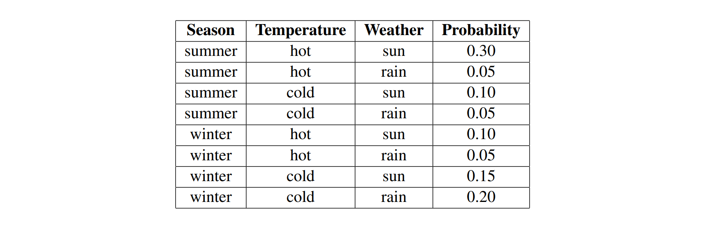

---
tags:
  - notes
comments: true
dg-publish: true
---

> [!PREREQUISITE]
>
> - [CS70-13-Introduction_of_Discrete_Probability](https://darstib.github.io/blog/note/cs70/13-Introduction_of_Discrete_Probability/)
> - [CS70-14-Conditional_Probability](https://darstib.github.io/blog/note/cs70/14-Conditional_Probability/)

## note

### Probability Rundown

- **Probability**

A random variable represents an event whose outcome is unknown. 
A probability distribution is an assignment of weights to outcomes, which must satisfies the following conditions:
(1) 0 $\leq P(\omega)\leq1$  (2)  $\sum_\omega P(\omega)=1$

- **Conditional Probability**
$$P(A|B)=\sum_{\omega\in A\cap B}P(\omega|B=\frac{P(A\cap B)}{P(B)}=\frac{P(B|A)P(A)}{P(B)}$$

- **Independent**
    - When A and B are mutually independent, P(A,B) = P(A)P(B), we write A⫫B. This is equivalent to B⫫A.
    - If A and B are conditionally independent given C, then P(A,B|C) = P(A|C)P(B|C), we write A ⫫ B|C. This is also equivalent to B⫫A|C.
### Inference By Enumeration (IBE)

Given a joint PDF[^1], we can trivially compute any desired probability distribution P($Q_1...Q_m|e_1...e_n$) using a simple and intuitive procedure known as **inference by enumeration**, for which we define three types of variables we will be dealing with:

1. **Query variables** $Q_i$ , which are unknown and appear on the left side of the conditional (|) in the desired probability distribution.
2. **Evidence variables** $e_{i}$ , which are observed variables whose values are known and appear on the right side of the conditional (|) in the desired probability distribution.
3. **Hidden variables**, which are values present in the overall joint distribution but not in the desired distribution.

[^1]: PDF指的是概率密度函数（Probability Density Function），用于描述连续随机变量在某个特定值附近的相对可能性。

In **Inference By Enumeration**, we follow the following algorithm:

1. Collect all the rows consistent with the observed evidence variables.
2. Sum out (marginalize) all the hidden variables.
3. Normalize the table so that it is a probability distribution (i.e. values sum to 1)

> [!EXAMPLE]
>
> 

If we wanted to compute P(W | S=winter) using the above joint distribution, we’d select the four rows where S is winter, then sum out over T and normalize.

Hence P(W=sun | S=winter) = 0.5 and P(W=rain | S=winter) = 0.5, and we learn that in winter there’s a 50% chance of sun and a 50% chance of rain.

## link

- [cs188-sp24-note10](https://inst.eecs.berkeley.edu/~cs188/sp24/assets/notes/cs188-sp24-note10.pdf)