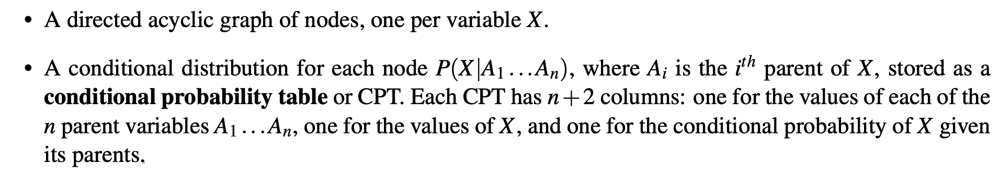
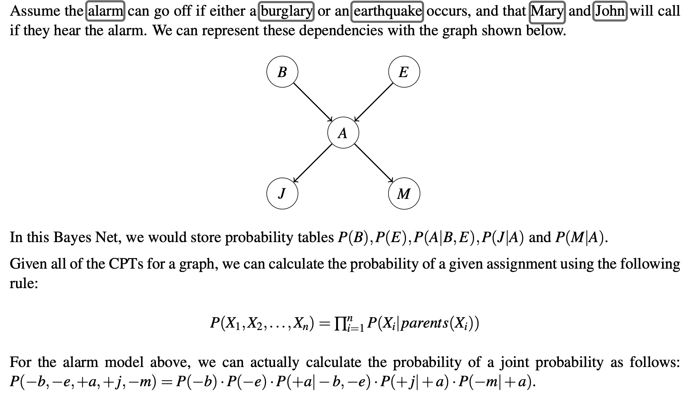

---
tags:
  - notes
  - cs188
comments: true
dg-publish: true
---

## note

### Bayesian Network Representation

If IBE used, each of n variables we wish to represent can take on d possible values (it has a domain of size d), then our joint distribution table will have $d^n$ entries, exponential in the number of variables and quite impractical to store!

Bayes nets avoid this issue by taking advantage of the idea of conditional probability.

> [!DEFINITION] Bayes Net
>
> We formally define a Bayes Net as consisting of:
> 
> 
> **example:** 

### Structure of Bayes Nets

Two rules for Bayes Net independences

- Each node is conditionally independent of all its ancestor nodes (non-descendants) in the graph, given all of its parents.
- Each node is conditionally independent of all other variables given its Markov blanket[^1].

[^1]: A variable’s Markov blanket consists of parents, children, children’s other parents.

> [!HELP]
>
> 这两个规则即是利用了条件概率的局部性，帮助我们将判断一个事件所需要考虑的其他事件的数量大大减少。

## link

- [cs188-sp24-note11](https://inst.eecs.berkeley.edu/~cs188/sp24/assets/notes/cs188-sp24-note11.pdf) 