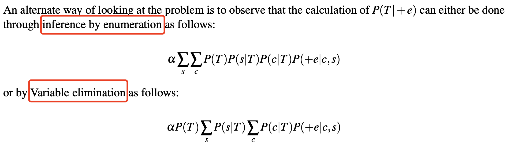

---
tags:
  - notes
  - cs188
comments: true
dg-publish: true
---

## note

### variable elimination

An alternate approach is to eliminate hidden variables one by one. To eliminate a variable X, we: 
1. Join (multiply together) all factors[^1] involving X. 
2. Sum out X.

[^1]: A factor is defined simply as an unnormalized probability

```python title="variable elimination"
def elimination_ask(X, e, bn):
    """
    Returns a distribution over X given evidence e using variable elimination.
    
    Parameters:
    X: Query variable
    e: Observed values for evidence variables
    bn: Bayesian network specifying joint distribution P(X1, ..., Xn)
    
    Returns:
    Normalized distribution over X
    """
    factors = []  # Initialize an empty list for factors
    for var in order(bn.VARS):  # Iterate over variables in a specified order
        factors = make_factor(var, e, factors)  # Create a factor for the current variable
        if var is a hidden variable:  # Check if the variable is hidden
            factors = sum_out(var, factors)  # Sum out the hidden variable from factors
    return normalize(pointwise_product(factors))  # Normalize the final distribution
```

> [!EXAMPLE]
>
> ```mermaid
> graph LR
>    T ---> A
>    T ---> B
>    A ---> C
>    B ---> C
> ```
> 
> 

### IBE vs. VE



## link

- [cs188-sp24-note12](https://inst.eecs.berkeley.edu/~cs188/sp24/assets/notes/cs188-sp24-note12.pdf) 