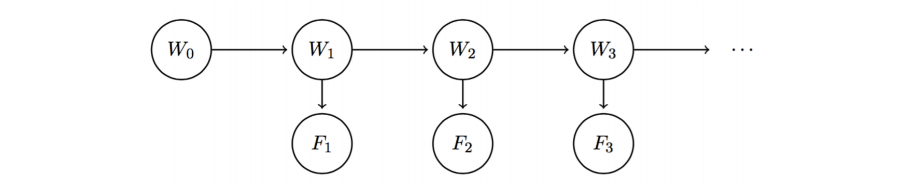
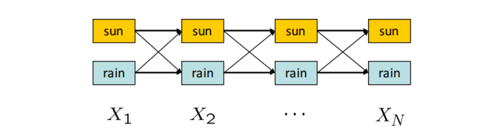
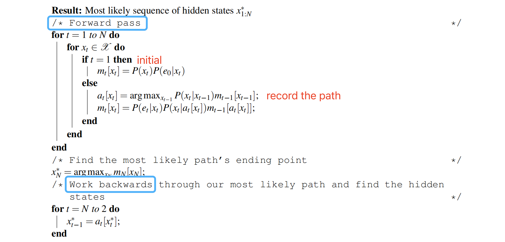

---
tags:
  - notes
  - cs188
comments: true
dg-publish: true
---

## note

We may collect new meteorological evidence that might affect our belief of the probability distribution in the process of predicting what the weather will be like on a given day from the initial state.

**Hidden Markov Model (HMM)** allows us to observe some evidence at each timestep, which can potentially affect the belief distribution at each of the states. Compared to the Markov model, the Hidden Markov model requires not only the initial distribution, the transition model, but also the **sensor model.**

To make distinction, we’ll call each $W_i$ a state variable and each weather forecast $F_i$ an evidence variable.

The model implies similar conditional indepencence relationships as standard Markov models, with an additional set of relationships for the evidence variables[^1]:

[^1]: 表达式 A⫫B∣C 表示在给定条件 C 的情况下，变量 A 和 B 是相互独立的

$$
\begin{aligned}&F_{1}\quad\perp\!\!\!\perp\quad W_{0}|W_{1}\\&
\forall i\quad=\quad2,\ldots,n;\quad W_{i}\perp\!\!\!\perp v\{W_{0},\ldots,W_{i-2},F_{1},\ldots,F_{i-1}\}|W_{i-1}\\&
\forall i\quad=\quad2,\ldots,n;\quad F_{i}\perp\!\!\!\perp\{W_{0},\ldots,W_{i-1},F_{1},\ldots,F_{i-1}\}|W_{i}\end{aligned}
$$

Just like Markov models, Hidden Markov Models make the assumption that the transition model $P(W_{i+1}|W_i)$ is stationary. Hidden Markov Models make the additional simplifying assumption that the sensor model $P(F_i|W_i)$ is stationary as well.

### notation

- $e_{i}$ : evidence observed at timestep i
	- $e_{1:t} := e_{1}, e_{2} \dots e_{t}$
- $B(W_{i})=P(W_{i}|f_{1},\dots f_{t})=P(W_{i}|f_{1:t})$ : the belief distribution at time i with all evidence $F1,\dots,Fi$ observed up to date
	- $B'(W_{i})=P(W_{i}|f_{1},\dots f_{t-1})=P(W_{i}|f_{1:(t-1)})$ : the belief distribution at time i with evidence $f_{1},\dots, f_{i−1}$ observed.

### Forward Algothrim

Noting that $B^{\prime}(W_{i+1})=P(W_{i+1}|f_1,\ldots,f_i)=\sum_{w_i}P(W_{i+1}|w_i,f_1,\ldots,f_i)P(w_i|f_1,\ldots,f_i)$ and $W_{i+1} \perp\!\!\!\perp f_{1: i} | W_{i}$, we can easily get: $\boxed{B^{\prime}(W_{i+1})=\sum_{{w_{i}}}P(W_{i+1}|w_{i})B(w_{i})}$.

After some derivation (see original note), we get: $B(W_{i+1})\propto P(f_{i+1}|W_{i+1})B^{\prime}(W_{i+1})$ , so we get $B(W_{i+1}) \sim B(W_{i})$.

> 根据原笔记，我认为应当是：$\boxed{B(W_{i+1}) =  \frac{P(f_{i+1}|W_{i+1})\sum_{{w_{i}}}P(W_{i+1}|w_{i})B(w_{i})}{P(f_{i+1}|f_{1:i})}}$ ，这就是 hidden marko model's forward algorithm.

### Viterbi Algorithm

The problem can also be solved for using **dynamic programming** with the **Viterbi algorithm**. To visualize the algorithm, consider the following state trellis, a graph of states and transitions over time:

In this HMM with two possible hidden states, sun or rain, we would like to compute **the highest probability path** (assignment of a state for every timestep) from $X_1$ to $X_N$.

The weights on an edge from $X_{t−1}$ to $X_t$ is equal to $P(X_t | X_{t−1})P(E_t | X_t)$[^2], and the probability of a path is computed by taking the product of its edge weights. 

[^2]: The first term in the weight formula represents how likely a particular transition is and the second term represents how well the observed evidence fits the resulting state.

If $P(X_{1}|X_{0}) := P(X_{1})$, we have $P(X_{1:N}, e_{1:N}) = \prod_{t=1}^NP(X_t|X_{t-1})P(e_t|X_t)$. In the Viberbi Algothrim, we want to compute $\arg\max_{x_1,..,x_N}P(x_{1:N},e_{1:N})$ to find the maximum likelihood estimate of the sequence of hidden states.

The algorithm consists of **two passes:** 
- the first runs forward in time and computes the probability of the best path to each (state, time) tuple given the evidence observed so far. 
- The second pass runs backwards in time: first it finds the terminal state that lies on the path with the highest probability, and then traverses backward through time along the path that leads into this state (which must be the best path).

Define $m_{t}[x_{t}] =\max_{x_{1}:t-1}P(x_{1:t}, e_{1: t})$, so we get:

$$
\begin{aligned}m_t[x_t]&=\max_{x_{1:t-1}}P(e_t|x_t)P(x_t|x_{t-1})P(x_{1:t-1},e_{1:t-1})\\&=P(e_t|x_t)\max_{x_{t-1}}P(x_t|x_{t-1})\max_{x_{1:t-2}}P(x_{1:t-1},e_{1:t-1})\\&=P(e_t|x_t)\max_{x_{t-1}}P(x_t|x_{t-1})m_{t-1}[x_{t-1}].\end{aligned}
$$

Using $a_t[x_t]=P(e_t|x_t)\arg\max_{x_{t-1}}P(x_t|x_{t-1})m_{t-1}[x_{t-1}]=\arg\max_{x_{t-1}}P(x_t|x_{t-1})m_{t-1}[x_{t-1}]$to keep track of the last transition, the pseudo-code is as follows:

## link

- [cs188-sp24-note15](https://inst.eecs.berkeley.edu/~cs188/sp24/assets/notes/cs188-sp24-note15.pdf) 