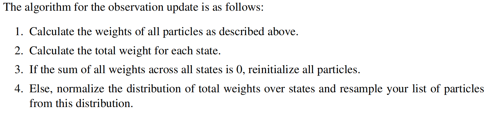
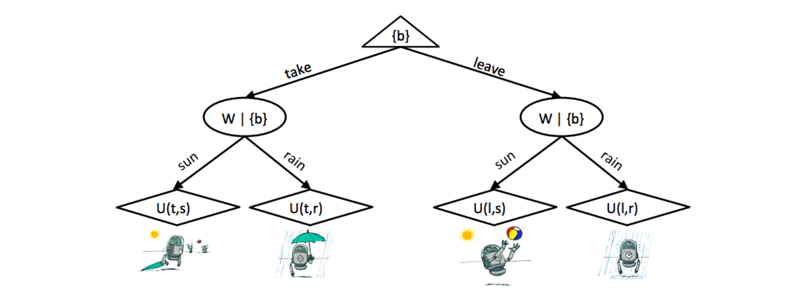

---
tags:
  - notes
  - cs188
comments: true
dg-publish: true
---

## note

### Particle Filtering

#### Introduction

Hidden Markov Models have the same drawback as bayes net - the time it takes to run exact inference with the forward algorithm scales with the number of values in the domains of the random variables.

The Hidden Markov Model analog to Bayes’ net sampling is called **particle filtering**, and involves simulating the motion of a set of particles through a state graph to approximate the probability (belief) distribution of the random variable in question. Our belief that a particle is in any given state at any given timestep is <u>dependent entirely on the number of particles in that state at that timestep in our simulation.</u> To recover a belief distribution from a particle list, all you need to do is count the number of particles and normalize them.

This solves the same question as the Forward Algorithm: it gives us an approximation of $P(X_{N}|e_{1:N})$ .

#### Simulation

- Particle Initialization
- Time Elapse Update - Update the value of each particle according to the transition model.
- Observation Update - During the observation update for particle filtering, we use the sensor model $P(F_{i}|T_{i})$ to weight each particle according to the probability dictated by the observed evidence and the particle’s state.
	- 

#### Utilities

Rational agents must follow the principle of maximum utility - they must always select the action that maximizes their expected utility. However, obeying this principle only benefits agents that have rational preferences.

> [!DEFINITION] The mathematical language of preferences:
>
>- If an agent prefers receiving a prize A to receiving a prize B, this is written $A \succ B$ . 
>- If an agent is indifferent between receiving A or B, this is written as $A \sim B$
>- A lottery is a situation with different prizes resulting with different probabilities. To denote lottery where A is received with probability p and B is received with probability (1− p), we write $L = [p, A; (1-p), B]$.

In order for a set of preferences to be rational, they must follow the five **Axioms of Rationality**:
- Orderability: $(A\succ B)\lor(B\succ A)\lor(A\sim B)$
- Transitivity: $(A\succ B)\land(B\succ C)\Rightarrow(A\succ C)$
- Continuity: $A\succ B\succ C\Rightarrow\exists p, \left[p,A;(1-p),C\right]\sim B$
- Substitutability: $A\sim B\Rightarrow[p,A;(1-p),C]\sim[p,B;(1-p),C]$
- Monotonicity: $A\succ B\Rightarrow(p\geq q\Leftrightarrow[p,A;\mathrm{~(1-p),B]\succeq[q,A;~(1-q),B]}$

If all five axioms are satisfied by an agent, there exists a real-valued utility function U that: $\begin{array}{rcl}U(A)\geq U(B)&\Leftrightarrow&A\succeq B&\text{(1)}\\U([p_1,S_1;\ldots;p_n,S_n])&=&\sum_ip_iU(S_i)&(2)\end{array}$ , examples omitted here.

### Decision Network

Now we’ll discuss a combination of both Bayes’ nets and expectimax known as a **decision network** that we can use to model the effect of various actions on utilities based on an overarching graphical probabilistic model.

In decision network:
- Chance node (ovals)
	- Chance nodes in a decision network behave identically to Bayes’ nets.
- Action node (rectangles)
	- Action nodes are nodes that we have complete control over.
- Utility node (diamonds)
	- Utility nodes are children of some combination of action and chance nodes.

> [!EXAMPLE]
>
> Let's say we're deciding whether or not to bring an umbrella
> 

Our goal with decision networks is again to select the action which yields the **maximum expected utility**(MEU), and the expected utility of taking an action a given evidence e and n chance nodes is computed with 

$$EU(a|e)=\sum_{x_1,...,x_n}P(x_1,...,x_n|e)U(a,x_1,...,x_n)$$

### The Value of Perfect Information (VPI)

We’ve generally always assumed that our agent has all the information it needs for a particular problem and/or has no way to acquire new information. In practice, this is hardly the case, and one of the most important parts of decision making is knowing whether or not it’s worth gathering more evidence to help decide which action to take.

In this section, we’ll talk about a very important concept - **the value of perfect information (VPI)** - which mathematically quantifies the amount an agent’s maximum expected utility is expected to increase if it observes some new evidence.

Mathematically, we represent it as:

$$
\begin{cases}
MEU(e)=\max_a\sum_sP(s|e)U(s,a) \\
MEU(e,e^{\prime})=\max_a\sum_sP(s|e,e^{\prime})U(s,a)
\end{cases} \implies VPI(e^{\prime}|e)=MEU(e,e^{\prime})-MEU(e)
$$

However, note that we don’t know what new evidence we’ll get, we use E' to represent e', so $MEU(e,E^{\prime})=\sum_{e^{\prime}}P(e^{\prime}|e)MEU(e,e^{\prime})$ and $\boxed{VPI(E^{\prime}|e)=MEU(e,E^{\prime})-MEU(e)}$.

Properties of VPI:
- Nonnegativity - $\forall E^{\prime},e\text{ VPI}(E^{\prime}|e)\geq0$
- Nonadditivity - $VPI(E_j,E_k|e)\neq VPI(E_j|e)+VPI(E_k|e)$ in general.
- Order-independence - $VPI(E_j,E_k|e)=VPI(E_j|e)+VPI(E_k|e_j)=VPI(E_k|e)+VPI(E_j|e,E_k)$

## link

- [cs188-sp24-note16](https://inst.eecs.berkeley.edu/~cs188/sp24/assets/notes/cs188-sp24-note16.pdf) 