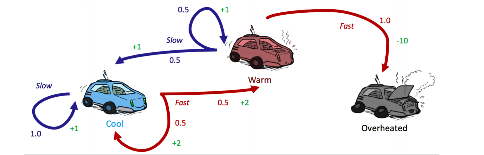
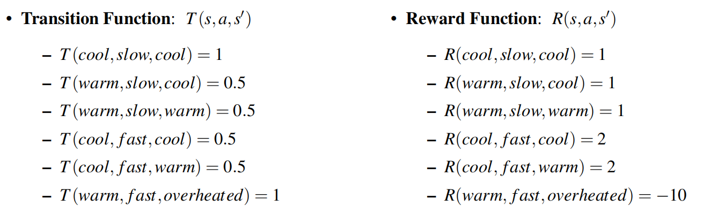
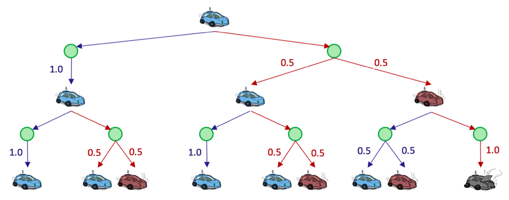

---
tags:
  - notes
  - cs188
comments: true
dg-publish: true
---

## note

A Markov Decision Process is defined by several properties:

- a set of states S and a start state, possibly one or more terminal states.
- a set of actions A.
- a transiton function $T(s, a, s')$
	- represents the **probability** tha an agent taking an action $a \in A$ from state $s \in S$ end up in a state $s' \in S$.
- a reward function $R(s, a, s')$
	- the agent’s objective is naturally to acquire the maximum reward possible before arriving at some terminal state.
- a utility function $U([s_{0}, a_{0}, s_{1}, a_{1}, s_{2}, \dots])$ for $s_0\xrightarrow{a_0}s_1\xrightarrow{a_1}s_2\xrightarrow{a_2}s_3\xrightarrow{a_3}...$
	- possibly a discount factor $\gamma$ (set 1 if not mentioned)
	- $U([s_0,a_0,s_1,a_1,s_2,...])=R(s_0,a_0,s_1)+\gamma R(s_1,a_1,s_2)+\gamma^2R(s_2,a_2,s_3)+...$
- **markovianess**
	- if we know the present state, knowing the past doesn’t give us any more information about the future
	- $P(S_{t+1}=s_{t+1}|S_t=s_t,A_t=a_t,...,S_0=s_0) = P(S_{t+1}=s_{t+1}|S_{t}=s_{t}, A_{t}=a_{t})$
	- $T(s,a,s')=P(s'|s,a)$

Consider the motivating example of a racecar:

- S = {cool, warm, overheated}
- A = {slow, fast}
- 

### Finite Horizons and Discount factors

We haven't placed any time constraints on the number of timesteps for which a race car can take actions and collect rewards. 

- **Finite horizons** (n)
	- it essentially defines a "lifetime" for agents, which gives them some set number of timesteps n to accrue as much reward as they can before being automatically terminated.
- **Discount factors** ($\gamma$)
	- if $\gamma < 1$, the discounted utility won't increse indefinitely, since:
	- $\begin{aligned}U([s_0,s_1,s_2,...])&=\quad R(s_0,a_0,s_1)+\gamma R(s_1,a_1,s_2)+\gamma^2R(s_2,a_2,s_3)+...\\&=\quad\sum_{t=0}^\infty\gamma^tR(s_t,a_t,s_{t+1})\leq\sum_{t=0}^\infty\gamma^tR_{max}=\boxed{\frac{R_{max}}{1-\gamma}}\end{aligned}$

### Solving MDP with the Bellman Equation

Solving a MDP means finding an optimal policy $\pi^{*}: S \rightarrow A$ , a function mapping each state $s \in S$ to an action $a \in A$.

Marko $U^*(s)=\max_aQ^*(s,a)$ v decision processes, like state-space graphs, can be unraveled into search trees. Uncertainty is modeled in these search trees with **Q-states**, also known as **action states**, essentially identical to expectimax chance nodes.

Let's efine the equation for the optimal value of a Q-state (a.k.a. optimal Q-value): 

$Q^*(s,a)=\sum_{s^{\prime}}T(s,a,s^{\prime})[R(s,a,s^{\prime})+\boldsymbol{\gamma}U^*(s^{\prime})]$

where $U^*(s)=\max_aQ^*(s,a)$ (namly the bellman equation - the optimal value of every state $s \in S$).

## link

- [cs188-sp24-note17](https://inst.eecs.berkeley.edu/~cs188/sp24/assets/notes/cs188-sp24-note17.pdf) 