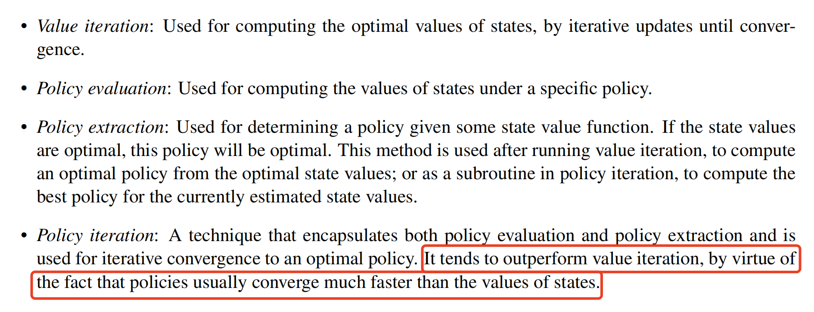

---
tags:
  - notes
  - cs188
comments: true
dg-publish: true
---

## note

### Value Iteration

Considering finite horizons, The time-limited value for a state s with a time-limit of k timesteps is denoted $U_k(s)$,

Value iteration is a dynamic programming algorithm that uses an iteratively longer time limit to compute time-limited values until convergence[^1] , operating as follows:

[^1]: convergence means that $\forall s \in S, U_{k+1}(s) = U_{k}(s)$.

1. $\forall s \in S$, initialze $U_{0}(s)=0$, since no actions can be taken to acquire rewards.
2. repear the following update rule until convergence (B is called the Bellman operator):

 $$
\forall s\in S,U_{k+1}(s)\leftarrow\max_{a}\sum_{s^{\prime}}T(s,a,s^{\prime})[R(s,a,s^{\prime})+\gamma U_{k}(s^{\prime})] ~~ (or \ \ U_{k+1} \leftarrow BU_{k})
$$

When convergence is reached, the Bellman equation will hold for every state: $\forall s \in S, U_{k+1}(s)=U_{k}(s) = U^*(s)$.

### Q-value Iteration

Q-value iteration is a dynamic programming algorithm that computes time-limited Q-values. It is described in the following equation: $Q_{k+1}(s,a)\leftarrow\sum_{s^{\prime}}T(s,a,s^{\prime})[R(s,a,s^{\prime})+\gamma\max_{a^{\prime}}Q_k(s^{\prime},a^{\prime})]$.

### Policy Iteration

#### policy extraction

$$\forall s\in S,\:\boldsymbol{\pi}^{*}(s)=\underset{a}{\operatorname*{\operatorname*{\operatorname*{argmax}}}}Q^{*}(s,a)=\underset{a}{\operatorname*{\operatorname*{\arg\max}}}\sum_{{s^{\prime}}}T(s,a,s^{\prime})[R(s,a,s^{\prime})+\boldsymbol{\gamma}U^{*}(s^{\prime})]$$

#### policy evaluation

For a policy π, policy evaluation means computing $U^π(s)$ for all states s, where $U^π(s)$ is expected utility of starting in state s when following π : 

$$U^{\boldsymbol{\pi}}(s)=\sum_{s^{\prime}}T(s,\boldsymbol{\pi}(s),s^{\prime})[R(s,\boldsymbol{\pi}(s),s^{\prime})+\boldsymbol{\gamma}U^{\boldsymbol{\pi}}(s^{\prime})]$$ 
#### policy improvement

Once we’ve evaluated the current policy, use policy improvement to generate a better policy.

Define the policy at iteration i of policy iteration as $\pi_{i}$ , we have 

$$U_{k+1}^{{\boldsymbol{\pi}_{i}}}(s)\leftarrow\sum_{{s^{\prime}}}T(s,\boldsymbol{\pi}_{i}(s),s^{\prime})[R(s,\boldsymbol{\pi}_{i}(s),s^{\prime})+\boldsymbol{\gamma}U_{k}^{{\boldsymbol{\pi}_{i}}}(s^{\prime})]$$

finally improve policy with:

$$\boldsymbol{\pi}_{i+1}(s)=\underset a{\operatorname*{argmax}}\sum_{s^{\prime}}T(s,a,s^{\prime})[R(s,a,s^{\prime})+\boldsymbol{\gamma}U^{\pi_i}(s^{\prime})]$$

### summary

## link

- [cs188-sp24-note18](https://inst.eecs.berkeley.edu/~cs188/sp24/assets/notes/cs188-sp24-note18.pdf)