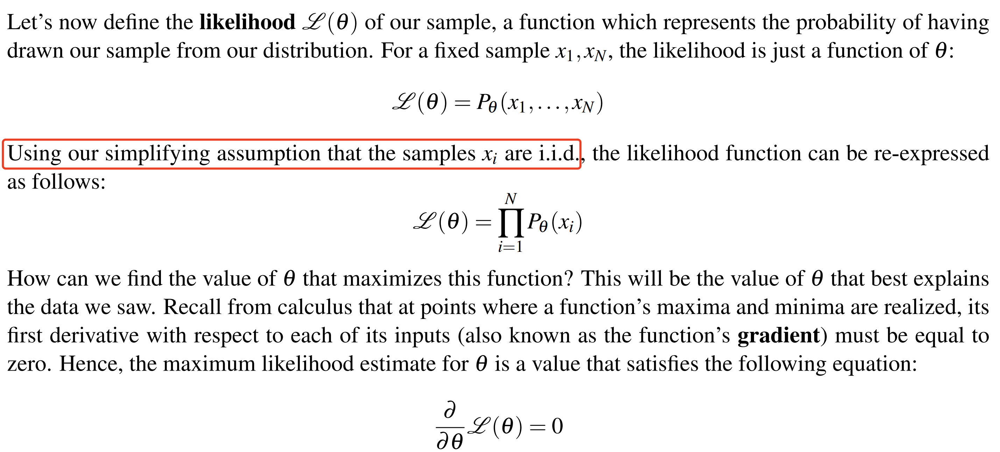

---
tags:
  - notes
  - cs188
comments: true
dg-publish: true
---

## note

> [!ATTENTION]
>
> 本人有些许机器学习基础，此处笔记对于从未接触过的人来说可能些许简略，建议查看原笔记；粗略但完整的讲解推荐 [Hung-yi Lee (李宏毅)](https://speech.ee.ntu.edu.tw/~hylee/index.html) 在國立臺灣大學开设的 [Introduction to Generative AI 2024 Spring](https://speech.ee.ntu.edu.tw/~hylee/genai/2024-spring.php)。

Until now, we’ve assumed that the probabilistic models we’ve worked with can be taken
for granted, and the methods by which the underlying probability tables we worked with were generated have been abstracted away[^1]. We’ll begin to break down this abstraction barrier as we delve into our discussion of **machine learning**.

[^1]: 这个长难句也是难绷的；参考翻译：直到现在，我们一直假设我们所使用的概率模型是理所当然的，而生成我们所用的概率表的那些方法也已经被抽象掉了。

Two primary subgroups of machine learning algorithms are **supervised learning algorithms** and **unsupervised learning algorithms**. We discuss the former now.

Once you have a dataset that you’re ready to learn with, the machine learning process usually involves splitting your dataset into three distinct subsets. 
- The first, **training data**, is used to actually generate a model mapping inputs to outputs. 
- Then, **validation data** (also known as hold-out or development data) is used to measure your model’s performance by making predictions on inputs and generating an accuracy score,
	- If your model doesn’t perform as well as you’d like it to, it’s always okay to go back and train again, either by adjusting special model-specific values called hyperparameters or by using a different learning algorithm altogether until you’re satisfied with your results. 
- Finally, use your model to make predictions on the third and final subset of your data, the **test set**. The test set is the portion of your data that’s never seen by your agent until the very end of development, and is the equivalent of a "final exam" to gauge performance on real-world data.

### Naive Bayes (classification problem)

Let’s consider the common problem of building an email spam filter which sorts messages into spam (unwanted email) or ham (wanted email). Such a problem is called a classification problem

To train a model to classify emails as spam or ham, we need some training data consisting of preclassified emails that we can learn from. However, emails are simply strings of text, and in order to learn anything useful, we need to extract certain attributes from each of them known as **features**. Features can be anything ranging from specific word counts to text patterns (e.g. whether words are in all caps or not) to pretty much any other attribute of the data that you can imagine. <u>In this note, f(x) refers to a feature function applied to all inputs x before putting them in the model.</u> 

Now let’s say you have a dictionary of n words, and from each email you extract a feature vector $F\in\mathbb{R}^n$ where the $i^{th}$ entry in F is a random variable $F_i$ which can take on a value of either a 0 or a 1 depending on whether the $i^{th}$ word in your dictionary appears in the email under consideration. Then we just compute the probability:

$$P(Y=spam|F_1=f_1,\ldots,F_n=f_n) \quad and\quad P(Y=ham|F_1=f_1,\ldots,F_n=f_n)$$

> 即，我们用布尔列表代表某个词是否出现在邮件中，以此作为特征向量；但是记住这一计算是 $O(2^n)$ 的，我们使用 bayes' net 来进行简化，时间复杂度降低至 $O(n)$.

This is solved by modeling the joint probability table with a Bayes’ net, making the critical simplifying <u>assumption that each feature Fi is independent of all other features given the class label.</u> This is a very strong modeling assumption (and the reason that **Naive Bayes** is called naive), but it simplifies inference and usually works well in practice. Then we get:

$$
\begin{aligned}prediction(F) = prediction(f_1,\cdots f_n)&=\underset{y}{\operatorname*{argmax~}}P(Y=y|F_1=f_1,\ldots F_N=f_n)\\&=\underset{y}{\operatorname*{argmax~}}P(Y=y,F_1=f_1,\ldots F_N=f_n)\\&=\underset{y}{\operatorname*{argmax~}}P(Y=y)\prod_{i=1}^{n}P(F_i=f_i|Y=y)\end{aligned}
$$

### Parameter Estimation

Assume you have a set of N sample points or observations, $x_1,\dots, x_N$, and you believe that this data was drawn from a distribution parametrized by an unknown value θ.

One answer to this question is to infer that θ is equal to the value that maximizes the probability of having selected your sample $x_1,\dots, x_N$ from your assumed probability distribution. A frequently used and fundamental method in machine learning known as **maximum likelihood estimation (MLE)** does exactly this.

Maximum likelihood estimation typically makes the following simplifying assumptions: 
- Each sample is drawn from the same distribution. In other words, each $x_i$ is identically distributed.
- Each sample $x_i$ is conditionally independent of the others, given the parameters for our distribution.
- All possible values of θ are equally likely before we’ve seen any data (this is known as a uniform prior).

The first two assumptions above are often referred to as **independent, identically distributed (i.i.d.).** The third assumption above makes the MLE method a special case of the maximum a priori (MAP) method, which allows for non-uniform priors

### Maximum Likelihood for Naive Bayes

Considering $f_{i}^{(j)}$ is a 1 if word i appeared in $j_th$ email under consideration and 0 otherwise, we get:

$$
\mathscr{L}(\boldsymbol{\theta})=\prod_{j=1}^{N_h}P(F_i=f_i^{(j)}|Y=ham)=\prod_{j=1}^{N_h}\theta^{f_i^{(j)}}(1-\theta)^{1-f_i^{(j)}}
$$

To simplify the problem, we use monotonic transformation, that is, taking the logarithm of $\mathscr{L}(\theta)$ :

$$
\begin{aligned}\log\mathscr{L}(\theta)&=\quad\log\left(\prod_{j=1}^{N_h}\theta^{f_i^{(j)}}(1-\boldsymbol{\theta})^{1-f_i^{(j)}}\right)\\&=\quad\sum_{j=1}^{N_h}\log\left(\theta^{f_i^{(j)}}(1-\boldsymbol{\theta})^{1-f_i^{(j)}}\right)\\&=\quad\sum_{j=1}^{N_h}\log\left(\theta^{f_i^{(j)}}\right)+\sum_{j=1}^{N_h}\log\left((1-\boldsymbol{\theta})^{1-f_i^{(j)}})\right)\\&=\quad\log(\theta)\sum_{j=1}^{N_h}f_i^{(j)}+\log(1-\boldsymbol{\theta})\sum_{j=1}^{N_h}(1-f_i^{(j)})\end{aligned}
$$

N - the number of observations (emails) you have for training. For our upcoming discussion, let’s also define $N_h$ as the number of training samples labeled as ham and $N_s$ as the number of training samples labeled as spam. Note $N_h +N_s = N$.

$$
\begin{aligned}
\frac\partial{\partial\boldsymbol{\theta}}\left(\log(\boldsymbol{\theta})\sum_{j=1}^{N_h}f_i^{(j)}+\log(1-\boldsymbol{\theta})\sum_{j=1}^{N_h}(1-f_i^{(j)})\right)&=0\\
\frac1\theta\sum_{j=1}^{N_h}f_i^{(j)}-\frac1{(1-\boldsymbol{\theta})}\sum_{j=1}^{N_h}f_i^{(j)}&=0\\
\frac1{\theta}\sum_{j=1}^{N_h}f_i^{(j)}&=\frac1{(1-\boldsymbol{\theta})}\sum_{j=1}^{N_h}(1-f_i^{(j)})\\
(1-\boldsymbol{\theta}\sum_{j=1}^{N_h}f_i^{(j)}&=\theta\sum_{j=1}^{N_h}(1-f_i^{(j)})\\\sum_{j=1}^{N_h}f_i^{(j)}-\boldsymbol{\theta}\sum_{j=1}^{N_h}f_i^{(j)}&=\theta\cdot N_h\\
\theta&=\frac1{N_h}\sum_{j=1}^{N_h}f_i^{(j)}=\theta\cdot N_h\\
\theta&=\frac1{N_h}\sum_{j=1}^{N_h}f_i^{(j)}\end{aligned}
$$

We’ve arrived at a remarkably simple final result!

### Laplace smoothing

Though maximum likelihood estimation is a very powerful method for parameter estimation, bad training data can often lead to unfortunate consequences. For example, if every time the word "minute" appears in an email in our training set, that email is classified as spam, our trained model will learn that $\boldsymbol{P}(F_{minute}=1|Y=ham)=0$; then every time "minute" appears, our model must consider it as spam. This is a classic example of **overfitting**, or building a model that doesn’t generalize well to previously unseen data.

Overfitting with Naive Bayes’ classifiers can be mitigated by Laplace smoothing. Conceptually, Laplace smoothing with strength k assumes having seen k extra of each outcome.

In N mails with |X| kinds of mails, $\forall x \in X$, if using MLE, we get $P_{MLE}(x)=\frac{count(x)}N$. And then let's assume that there are k more of each of these messages in the sample. So we get:

$$P_{LAP,k}(x)=\frac{count(x)+k}{N+k|X|} \implies P_{LAP,k}(x|y)=\frac{count(x,y)+k}{count(y)+k|X|}$$ 
The specific value of k that’s appropriate to use in our model is typically determined by trial-and-error. k is a hyperparameter in our model, which means that we can set it to whatever we want and see which value yields the best prediction accuracy/performance on our validation data.

- $P_{LAP,k}(x)=\frac{count(x)+k}{N+k|X|}$ 
- $P_{LAP,0}(x)=\frac{count(x)}{N} = P_{MEL}(x)$   
- $P_{LAP,\infty}(x)=\frac{1}{|X|}$ 

## link

- [cs188-sp24-note19](https://inst.eecs.berkeley.edu/~cs188/sp24/assets/notes/cs188-sp24-note19.pdf) 