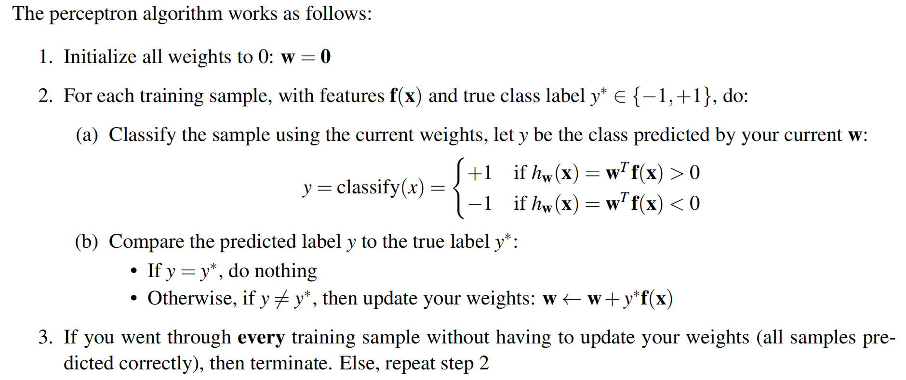
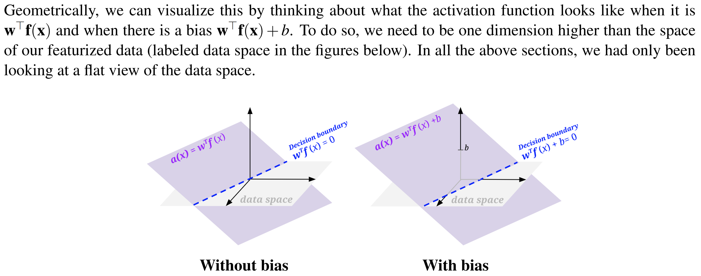
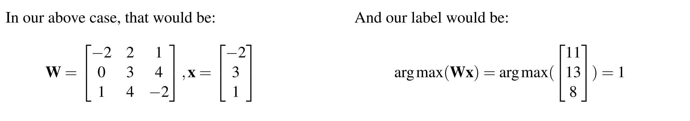

---
tags:
  - notes
  - cs188
comments: true
dg-publish: true
---

## note

### Linear Classifiers

The basic idea of a linear classifier is to do classification using a linear combination of the features– a value which we call the activation. Concretely, the activation function takes in a data point, multiplies each feature of our data point, $f_i(x)$, by a corresponding weight, wi , and outputs the sum of all the resulting values. In vector form, we can also write this as a dot product of our weights as a vector, w, and our featurized data point as a vector f(x):

$$\mathrm{activation}_{w}(\mathbf{x})=h_{{\mathbf{w}}}(\mathbf{x})=\sum_{i}w_{i}f_{i}(\mathbf{x})=\mathbf{w}^{T}\mathbf{f}(\mathbf{x})=\mathbf{w}\cdot\mathbf{f}(\mathbf{x})$$

### Binary Perceptron

$$
\text{classify}(\mathbf{x})=\begin{cases} 
+&\mathrm{if~}h_{\mathbf{w}}(\mathbf{x})>0 \iff \cos{\theta } > 0 \iff 0<\theta  < \frac{\pi}{2} \\ 
-&\mathrm{if~}h_{\mathbf{w}}(\mathbf{x})<0  \iff \cos{\theta } < 0 \iff  \frac{\pi}{2} < \theta < \pi \\ 
\end{cases}
$$
 

We call this blue line the **decision boundary** because it is the boundary that separates the region where we classify data points as positive from the region of negatives. In higher dimensions, a linear decision boundary is generically called a **hyperplane**.

$$
\mathbf{h_{w+y^{*}f(x)}(x)= (w+y^{*}f(x))^T f(x)=h_{w}(x)+y^{*}f(x)^T f(x)}
$$

where $\mathbf{f(x)^T f(x)}$ is a positive number, so the $\mathbf{h_{w}(x)}$ changes in the direction of $y^*$.

#### Bias

Any decision boundary that you end up drawing will be crossing the origin. Basically, our perceptron can only produce a decision boundary that could be represented by the function $\mathbf{w}^\top\mathbf{f}(\mathbf{x})=0,\mathbf{w},\mathbf{f}(\mathbf{x})\in\mathbb{R}^n$. We will modify our feature and weights to add a bias term $\mathbf{b}$.

If $\mathbf{w'=w+\{1\}, f'(x)=f(x)+\{b\}}$, we also have: $\mathbf{w'^T f'(x)=0}$ .

### Multiclass Perceptron

For the multi-class case, we will have one weight vector for each class. In order to classify a sample, we compute a score for each class by taking the dot product of the feature vector with each of the weight vectors. Whichever class yields the highest score is the one we choose as our prediction.

Instead of doing as many dot products as there are classes, we can instead do a single matrix-vector multiplication. This tends to be much more efficient in practice (because matrix-vector multiplication usually has a highly optimized implementation).

## link

- [cs188-sp24-note0](https://inst.eecs.berkeley.edu/~cs188/sp24/assets/notes/cs188-sp24-note0.pdf) 