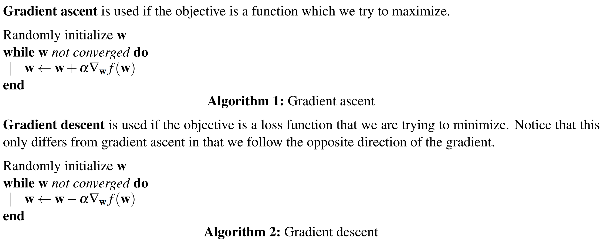
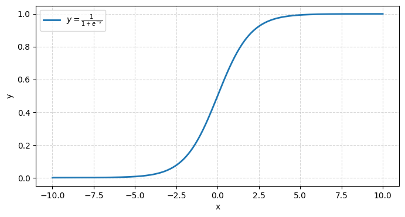

---
tags:
  - notes
  - cs188
comments: true
dg-publish: true
---

## note

### Linear Regression

Regression problems are a form of machine learning problem in which the output is a continuous variable (denoted with y). The features can be either continuous or categorical. We will denote a set of features with $x \in \mathbb{R}^n$ for n features, i.e. $\mathbf{x} = (x_1 , \dots, x_n)$.

The quantities y, X and w are defined as follows:

$$
\mathbf{y}=\begin{bmatrix}y^1\\y^2\\\vdots\\y^n\end{bmatrix},\:\mathbf{X}=\begin{bmatrix}1&x_1^1&\cdots&x_1^n\\1&x_2^1&\cdots&x_2^n\\\vdots&\vdots&\cdots&\vdots\\1&x_N^1&\cdots&x_N^n\end{bmatrix},\:\mathbf{w}=\begin{bmatrix}w_0\\w_1\\\vdots\\w_n\end{bmatrix} \leftrightarrow \mathbf{\hat{y}=Xw}
$$

If we use the L2 loss function which penalizes the difference of the predicted from the actual output using the L2 norm:

$$
Loss(h_{\mathbf{w}})=\frac{1}{2}\sum_{j=1}^{N}L2(y^{j},h_{\mathbf{w}}(\mathbf{x}^{j}))=\frac{1}{2}\sum_{j=1}^{N}(y^{j}-h_{\mathbf{w}}(\mathbf{x}^{j}))^{2}=\frac{1}{2}\left\|\mathbf{y}-\mathbf{X}\mathbf{w}\right\|_{2}^{2}
$$

More specifically, we will find the $\mathbf{\hat{w}}$ that minimizes the loss function by differentiating the loss function and setting the derivative equal to zero:

$$
\begin{aligned}\nabla_\mathbf{w}\frac12\left\|\mathbf{y}-\mathbf{X}\mathbf{w}\right\|_2^2&=\nabla_\mathbf{w}\frac12\left(\mathbf{y}-\mathbf{X}\mathbf{w}\right)^T\left(\mathbf{y}-\mathbf{X}\mathbf{w}\right)=\nabla_\mathbf{w}\frac12\left(\mathbf{y}^T\mathbf{y}-\mathbf{y}^T\mathbf{X}^T\mathbf{y}+\mathbf{w}^T\mathbf{X}\mathbf{w}\right)\\&=\nabla_\mathbf{w}\frac12\left(\mathbf{y}^T\mathbf{y}-2\mathbf{w}^T\mathbf{X}^T\mathbf{y}+\mathbf{w}^T\mathbf{X}\mathbf{w}\right)=-\mathbf{X}^T\mathbf{y}+\mathbf{X}^T\mathbf{X}\mathbf{w}\end{aligned}
$$

then:

$$
\nabla_\mathbf{w}\frac12\left\|\mathbf{y}-\mathbf{X}\mathbf{\hat{w}}\right\|_2^2 = 0  \implies \hat{\mathbf{w}}=(\mathbf{X}^T\mathbf{X})^{-1}\mathbf{X}^T\mathbf{y}
$$

### Optimization

In complicated cases, we can use **gradient-based methods** to find the optimal weights, as shown below ($\alpha$ stands for learning rate).

 
If our dataset has a large number of n data points then computing the gradient as above in each iteration of the gradient descent algorithm might be too computationally intensive. As such, approaches like stochastic and batch gradient descent have been proposed.

#### stochastic gradient descent

In stochastic gradient descent at each iteration of the algorithm we use only one data point to compute the gradient. That one data point is each time randomly sampled form the dataset. Given that we only use one data point to estimate the gradient, stochastic gradient descent can lead to noisy gradients and thus make convergence a bit harder.

#### Mini-batch gradient descent

Mini-batch gradient descent uses a batch of size m of data points each time to compute the gradients. The batch size m is a user specified parameter.

### Logistic Regression

Logistic regression allows us to turn a linear combination of our input features into a probability using the logistic function: $h_\mathbf{w}(\mathbf{x})=\frac1{1+e^{-\mathbf{w}^T\mathbf{x}}}$. It is important to note that though logistic regression is named as regression, this is a misnomer. Logistic regression is used to solve classification problems, not regression problems (for its function looks like:)

$$
\begin{cases}
P(y=+1|\mathbf{f}(\mathbf{x});\mathbf{w})=\frac1{1+e^{-\mathbf{w}^T\mathbf{f}(\mathbf{x})}}\quad \\
P(y=-1|\mathbf{f}(\mathbf{x});\mathbf{w})=1-\frac1{1+e^{-\mathbf{w}^T\mathbf{f}(\mathbf{x})}}
\end{cases}
$$

### Multi-Class Logistic Regression

We use the **softmax function** in place of the logistic function 

$$
P(y=i|\mathbf{f}(\mathbf{x});\mathbf{w})=\frac{e^{\mathbf{w}_i^T\mathbf{f}(\mathbf{x})}}{\sum_{k=1}^Ke^{\mathbf{w}_k^T\mathbf{f}(\mathbf{x})}}
$$

Hence, we can now express the likelihood as follows:

$$
\ell(\mathbf{w}_1,\ldots,\mathbf{w}_K)=\prod_{i=1}^n\prod_{k=1}^K\left(\frac{e^{\mathbf{w}_k^T\mathbf{f}(\mathbf{x}_i)}}{\sum_{\ell=1}^Ke^{\mathbf{w}_\ell^T\mathbf{f}(\mathbf{x}_i)}}\right)^{t_{i,k}}
\implies
\log\ell(\mathbf{w}_1,\ldots,\mathbf{w}_K)=\sum_{i=1}^n\sum_{k=1}^Kt_{i,k}\log\left(\frac{e^{\mathbf{w}_k^T\mathbf{f}(\mathbf{x}_i)}}{\sum_{\ell=1}^Ke^{\mathbf{w}_\ell^T\mathbf{f}(\mathbf{x}_i)}}\right)
$$

In the example of the multi-class logistic regression the gradient with respect to $w_j$ is given by:

$$
\nabla_{\mathbf{w}_j}\log\ell(\mathbf{w})=\sum_{i=1}^n\nabla_{\mathbf{w}_j}\sum_{k=1}^Kt_{i,k}\log\left(\frac{e^{\mathbf{w}_k^T\mathbf{f}(\mathbf{x}_i)}}{\sum_{\ell=1}^Ke^{\mathbf{w}_\ell^T\mathbf{f}(\mathbf{x}_i)}}\right)=\sum_{i=1}^n\left(t_{i,j}-\frac{e^{\mathbf{w}_j^T\mathbf{f}(\mathbf{x}_i)}}{\sum_{\ell=1}^Ke^{\mathbf{w}_\ell^T\mathbf{f}(\mathbf{x}_i)}}\right)\mathbf{f}(\mathbf{x}_i)
$$

where we used the fact that $\sum_{k}{t_{i,k}}=1$.

## link

- [cs188-sp24-note21](https://inst.eecs.berkeley.edu/~cs188/sp24/assets/notes/cs188-sp24-note21.pdf)