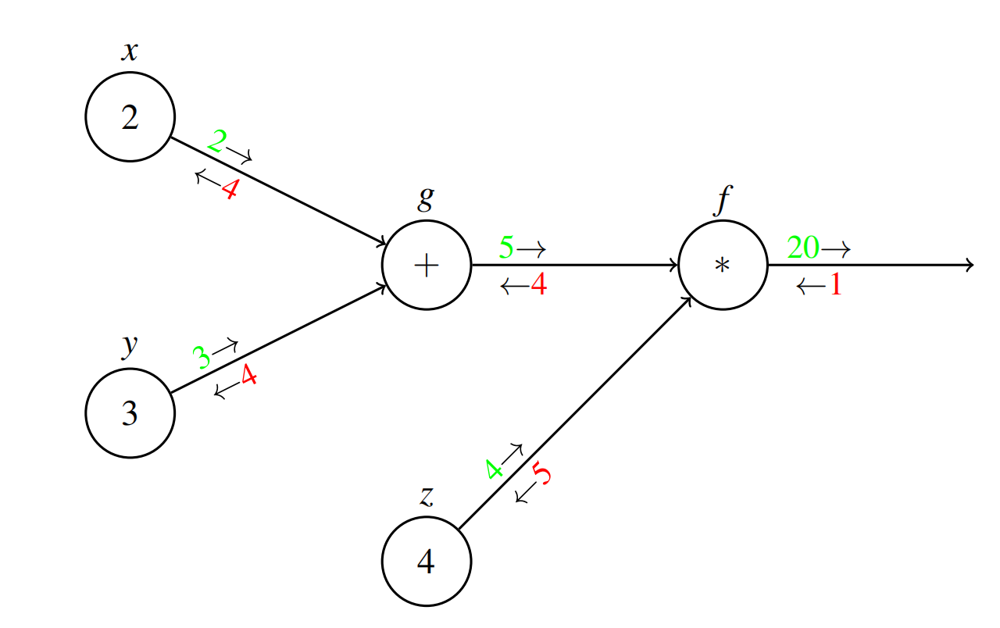

---
tags:
  - notes
  - cs188
comments: true
dg-publish: true
---

## note

### Non-linear Separators

Consider the following set of data:

We would like to separate the two colors, and clearly there is no way this can be done in a single dimension (a single dimensional decision boundary would be a point, separating the axis into two regions). To fix this problem, we can add additional (potentially nonlinear) features to construct a decision boundary from. Consider the same dataset with the addition of $x^2$ as a feature:

With this additional piece of information, we are now able to construct a linear separator in the two dimensional space containing the points. In this case, we were able to fix the problem by mapping our data to a higher dimensional space by manually adding useful features to data points. However, in many highdimensional problems, such as image classification, manually selecting features that are useful is a tedious problem. This requires domain-specific effort and expertise, and works against the goal of generalization across tasks. A natural desire is to learn these featurization or transformation functions as well, perhaps using a nonlinear function class that is capable of representing a wider variety of functions.

### Multi-layer Perceptron

Consider the following setup, a two-layer perceptron, which is a perceptron that takes as input the outputs of another perceptron.

In fact, we can generalize this to an N-layer perceptron.

> [!THEOREM] Universal Function Approximators
>
> A two-layer neural network with a sufficient number of neurons can approximate any continuous function to any desired accuracy.

### Measuring Accuracy

The accuracy of the binary perceptron after making n predictions can be expressed as:

$$
l^{acc}(w)=\frac1n\sum_{i=1}^n(sgn(w\cdot\mathbf{f}(\mathbf{x}_i))==y_i)\quad where\quad 
sgn(x)=
\begin{cases}
+1, & x > 0 \\
0, & x = 0 \\
-1, & x < 0
\end{cases}
$$

### Multi-layer Feedforward Neural Networks

Multi-layer NN is much like the multi-layer perceptron, however, we choose a different non-linearity to apply after the individual perceptron nodes. Non-linearities makes the network as a whole non-linear and more expressive.

- $\text{Sigmoid: }\sigma(x)=\frac1{1+e^{-x}}$
- $ReLU{:~}f(x)=max(0, x)=\begin{cases}0&\mathrm{if~}x<0\\x&\mathrm{if~}x\geq0&\end{cases}$

### Backpropagation

To efficiently calculate the gradients for each parameter in a neural network, we will use an algorithm known as backpropagation. Backpropagation represents the neural network as a dependency graph of operators and operands, called a computational graph, such as the one shown below for computing $(2+3)*4$ ($g=(x+y) \land f = g*z$):

Recall the chain rule in calculus (for $f(x_{1}, x_{2}, \dots x_{n})$ where $x_{k}(t_{1}, t_{2}, \dots , t_{m})$):

$$
\frac{\partial f}{\partial t_{i}}=\frac{\partial f}{\partial x_{1}}\cdot\frac{\partial x_{1}}{\partial t_{i}}+\frac{\partial f}{\partial x_{2}}\cdot\frac{\partial x_{2}}{\partial t_{i}}+\ldots+\frac{\partial f}{\partial x_{n}}\cdot\frac{\partial x_{n}}{\partial t_{i}}.
$$

Values in green are the outputs of each node, which we compute in the forward pass, where we apply each node’s operation to its input values coming from its parent nodes.

Values in red after each node give gradients of the function computed by the graph, which are computed in the backward pass: the red `1` after $f$ stands for $\frac{\partial f}{\partial f}$; red `4` after $g / z$ stands for $\frac{\partial f}{\partial g} / \frac{\partial f}{\partial z}$. Then gets $\frac{\partial f}{\partial x} / \frac{\partial f}{\partial y}$ .

Computation graphs are a great way to visualize repeated application of the chain rule from calculus, as this process is required for backpropagation in neural networks.

## link

- [cs188-sp24-note22](https://inst.eecs.berkeley.edu/~cs188/sp24/assets/notes/cs188-sp24-note22.pdf)