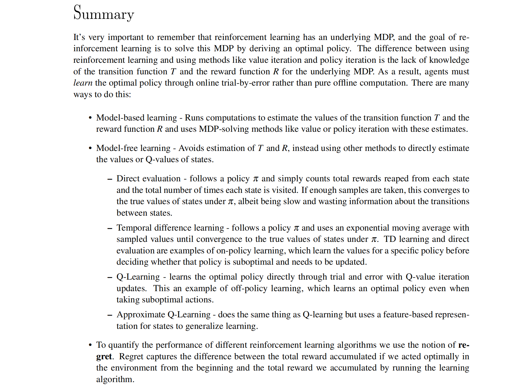

---
tags:
  - notes
  - cs188
comments: true
dg-publish: true
---

## note

In the previous note, solving Markov decision processes is an example of **offline planning**, where agents have full knowledge of both the transition function and the reward function, all the information they need to precompute optimal actions in the world encoded by the MDP without ever actually taking any actions. In this note, we’ll discuss **online planning**, during which an agent has no prior knowledge of rewards or transitions in the world (still represented as a MDP).

In online planning, an agent must try **exploration**, during which it performs actions and receives feedback in the form of the successor states it arrives in and the corresponding rewards it reaps. The agent uses this feedback to estimate an optimal policy through a process known as **reinforcement learning** before using this estimated policy for exploitation or reward maximization.

There are two types of reinforcement learning, model-based learning and model-free learning. 
- Modelbased learning attempts to estimate the transition and reward functions with the samples attained during exploration before using these estimates to solve the MDP normally with value or policy iteration. 
- Modelfree learning, on the other hand, attempts to estimate the values or Q-values of states directly, without ever using any memory to construct a model of the rewards and transitions in the MDP.

> 内容很紧，原 note 没有啥可以省略的，建议直接看原文，下面是很好的总结：

## link

- [cs188-sp24-note24](https://inst.eecs.berkeley.edu/~cs188/sp24/assets/notes/cs188-sp24-note24.pdf)
- [cs188-sp24-note25](https://inst.eecs.berkeley.edu/~cs188/sp24/assets/notes/cs188-sp24-note25.pdf)