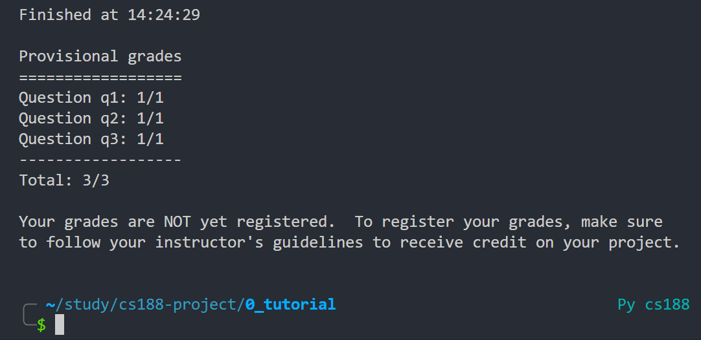

---
tags:
  - notes
comments: true
---


## link

- [Project 0 _ CS 188 Spring 2024](../materials/project/intro_page/Project%200%20_%20CS%20188%20Spring%202024.html)

## explain

这个是让我们熟悉项目使用和 python 的考察，没啥好讲的。

```shell
python autograder.py # 评分全部
python autograder.py -q q1 # 测试第一问
```

## pass



## code