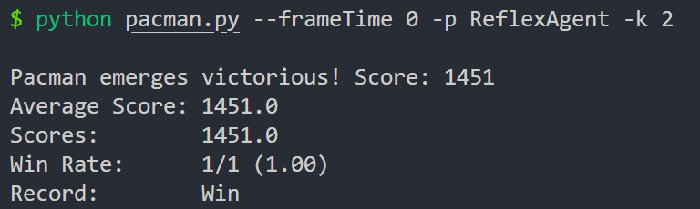
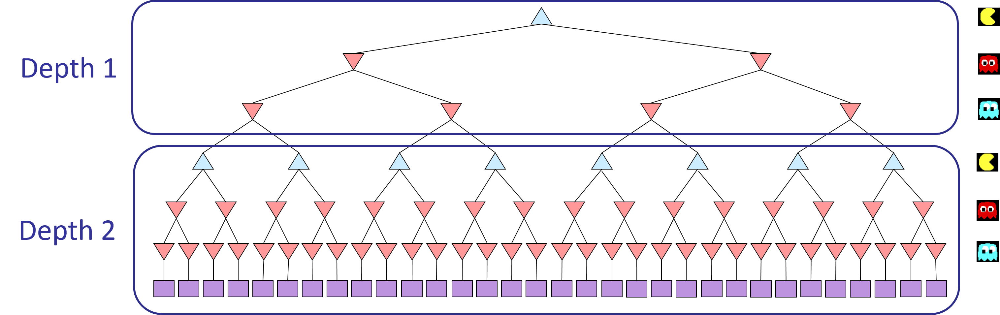
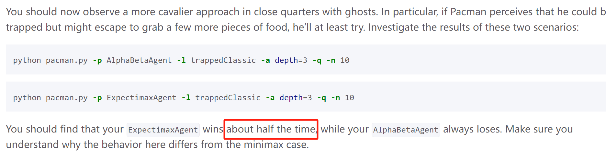

---
tags:
  - notes
comments: true
dg-publish: true
---

# MultiAgent

> [!PREREQUISITE]
>
> - [05-Trees_Minimax_Pruning](../note/05-Trees_Minimax_Pruning.md)
> - [06-Expectimax_Monte_Carlo_Tree_Search](../note/06-Expectimax_Monte_Carlo_Tree_Search.md)
> - [preject 2](https://inst.eecs.berkeley.edu/~cs188/sp24/projects/proj2/) （若需要认证，可见[仓库](https://github.com/Darstib/cs188/tree/main/materials/project/intro_page)）

## Quick Review

- 博弈树（Game Tree）
	- 博弈树是一种图形结构，用于表示博弈中的所有可能状态及其相应的决策。树的节点代表游戏状态，边代表玩家的行动。通过分析博弈树，玩家可以评估不同策略的结果，从而选择最佳行动。
- Minimax（极小极大算法）
	- 一种决策算法，用于在零和游戏中寻找最佳策略，通过假设对手也会采取最佳行动，从而最小化可能的损失或最大化可能的收益。
- Alpha-Beta Pruning（α-β 剪枝）
	- 一种优化算法，用于减少在博弈树中评估的节点数量，从而提高 minimax 算法的效率，常用于决策过程中。
- Evaluation Functions（评估函数）
	- 在决策中用于估计特定局面的函数，帮助 Agent 判断当前状态的优劣，以便做出最佳决策。
- Expectimax（期望极大算法）
	- 一种扩展的决策算法，适用于包含随机性因素的博弈，通过计算每个可能结果的期望值来选择最佳行动，常用于棋类游戏和其他不确定环境中的决策。
- Mixed Layer Types（混合层类型）
	- 在决策过程中，我们的对手不一定只有一个（但是目的相同），他们依次行动，每人依次在博弈树上占有一层。
- General Game（通用游戏）
	- 我们的多个对手的目的并非相同，对手的执行顺序对结果影响巨大。
- Monte Carlo Tree Search（蒙特卡洛树搜索）
	- 蒙特卡洛树搜索是一种启发式搜索算法，通过随机采样和模拟来评估游戏树中的节点，帮助做出决策。

## explain

### Q1 (4 pts): Reflex Agent

文档提醒我们关注：

```python title="game.py -> Grid"
class Grid:
    """
    A 2-dimensional array of objects backed by a list of lists.  Data is accessed via grid[x][y] where (x,y) are positions on a Pacman map with x horizontal, y vertical and the origin (0,0) in the bottom left corner.
    """
    def __init__(self, width, height, initialValue=False, bitRepresentation=None):
        if initialValue not in [False, True]:
            raise Exception('Grids can only contain booleans')
        self.CELLS_PER_INT = 30
    
        self.width = width
        self.height = height
        self.data = [[initialValue for y in range(
            height)] for x in range(width)]
        if bitRepresentation:
            self._unpackBits(bitRepresentation)
    ... # 省略一些关系不大的内容
    def asList(self, key=True):
        list = []
        for x in range(self.width):
            for y in range(self.height):
                if self[x][y] == key:
                    list.append((x, y))
        return list
```

#### explore

对于 evalution，我们之前使用过曼哈顿距离，这里不妨继续使用；不同的是，这次我们应该把 ghost 的位置也考虑进来了；此外，距离食物越近，鬼魂越远，得分应当越高，这里按照 project 2 中的提示使用倒数：

```python title="evalutionFunction v1"
def evaluationFunction(self, currentGameState: GameState, action):
    # Useful information you can extract from a GameState (pacman.py)
    successorGameState = currentGameState.generatePacmanSuccessor(action)
    newPos = successorGameState.getPacmanPosition()
    newFood = successorGameState.getFood()
    newGhostStates = successorGameState.getGhostStates()
    newScaredTimes = [ghostState.scaredTimer for ghostState in newGhostStates]
    
    # return successorGameState.getScore()
    "*** YOUR CODE HERE ***"
    # Get the food list and initial score
    foodList = newFood.asList()
    score = successorGameState.getScore()
    # Fooe evaluation
    for food in foodList:
        score += 1 / util.manhattanDistance(newPos, food)
    
    # Ghost evaluation
    for i, ghostState in enumerate(newGhostStates):
        ghostPos = ghostState.getPosition()
        distance = util.manhattanDistance(newPos, ghostPos)
        if newScaredTimes[i] > 0:
            # Ghost is scared, it's good to be close
            score += 2 / (distance + 1) # avoid ZeroDivisionError
        else:
            score -= 2 / (distance + 1)  
    
    return score
```

[Q1 半通过](attachments/project-2-1.png)

#### right

可以看到死了两次，但是平均分还是挺高的；但是依照我们的成绩标准，不死才是比较好的；所以我们离 ghost 远一点，近了就给个“差评”：

```python title="evalutionFunciotn v2"
def evaluationFunction(self, currentGameState: GameState, action):
    # Useful information you can extract from a GameState (pacman.py)
    successorGameState = currentGameState.generatePacmanSuccessor(action)
    newPos = successorGameState.getPacmanPosition()
    newFood = successorGameState.getFood()
    newGhostStates = successorGameState.getGhostStates()
    newScaredTimes = [ghostState.scaredTimer for ghostState in newGhostStates]
    
    # return successorGameState.getScore()
    "*** YOUR CODE HERE ***"
    # Get the food list and initial score
    foodList = newFood.asList()
    score = successorGameState.getScore()
    for food in foodList:
        score += 1 / util.manhattanDistance(newPos, food)
    
    # Ghost evaluation
    for i, ghostState in enumerate(newGhostStates):
        ghostPos = ghostState.getPosition()
        distance = util.manhattanDistance(newPos, ghostPos)
        if newScaredTimes[i] > 0:
            # Ghost is scared, it's good to be close
            score += 2 / (distance + 1) # avoid ZeroDivisionError
        else:
            if distance < 2: # min_distance
                score -= 500  # Big penalty for being too close
            else:
                score -= 2 / (distance + 1)
    
    return score
```

[Q1 通过](attachments/project-2.png)

可以看到最后一次为了躲避 ghost 分数低于了 1000，但是活着才是硬道理。当然存在随机性，[都高于 1000](attachments/project-2-3.png) 也不是不可；如果将 min_distance 改为 1，效果和 v1 差不多，可能是逃跑的太晚了吧 hhh 。

最后再来测试一下 `python pacman.py --frameTime 0 -p ReflexAgent -k 2` 



可以看到也成功通过了；min_distance = 1 时则失败。

### Q2 (5 pts): Minimax

#### explore

在 project-2 中给出了一个 depth=2 时的决策树，我将其分为若干层 level （最上方为 level=0）：



思路：getAction 仿照 Q1 中的

```python title="MinimaxAgent -> getAction v1"
def getAction(self, gameState: GameState):
    "*** YOUR CODE HERE ***"
    # Pacman is always agent 0, and the agents move in order of increasing agent index.
    legalActions = gameState.getLegalActions(0)
    scores = self.getNextLevel(gameState, 0, 0)
    bestScore = max(scores)
    bestIndices = [
        index for index in range(len(scores)) if scores[index] == bestScore
    ]
    chosenIndex = random.choice(bestIndices)  # Pick randomly among the best
    return legalActions[chosenIndex]
    util.raiseNotDefined()

# return a scores: [int]
def getNextLevel(self, gameState: GameState, agentIndex, level):
    agentIndex = agentIndex % gameState.getNumAgents()
    legalActions = gameState.getLegalActions(agentIndex)
    successors = [
        gameState.generateSuccessor(agentIndex, action) for action in legalActions
    ]
    return [
        self.getValue(successor, agentIndex + 1, level + 1)
        for successor in successors
    ]

# return a score
def getValue(self, gameState: GameState, agentIndex=0, level=0):
    if (
        gameState.isWin()
        or gameState.isLose()
        or level == self.depth * gameState.getNumAgents()
    ):
        return self.evaluationFunction(gameState)
    if agentIndex == 0:
        return max(self.getNextLevel(gameState, agentIndex, level))
    else:
        return min(self.getNextLevel(gameState, agentIndex, level))
```

#### right

```python title="MinimaxAgent -> getAction v2"
def getAction(self, gameState: GameState):
    "*** YOUR CODE HERE ***"
    def getValue(state, agentIndex, depth):
        agentIndex = agentIndex % state.getNumAgents()
        if state.isWin() or state.isLose() or depth == 0:
            return self.evaluationFunction(state)
        elif agentIndex == 0:
            return max(
                getValue(
                    state.generateSuccessor(agentIndex, action),
                    agentIndex + 1,
                    depth - 1,
                )
                for action in state.getLegalActions(agentIndex)
            )
        else:
            return min(
                getValue(
                    state.generateSuccessor(agentIndex, action),
                    agentIndex + 1,
                    depth - 1,
                )
                for action in state.getLegalActions(agentIndex)
            )
    # Pacman is always agent 0, and the agents move in order of increasing agent index.
    legalActions = gameState.getLegalActions(0)
    scores = [
        getValue(
            gameState.generateSuccessor(0, action),
            1,
            self.depth * gameState.getNumAgents() - 1,
        )
        for action in legalActions
    ]
    bestScore = max(scores)
    bestIndices = [
        index for index in range(len(scores)) if scores[index] == bestScore
    ]
    chosenIndex = random.choice(bestIndices)  # Pick randomly among the best
    return legalActions[chosenIndex]
```

[Q2 通过](attachments/project-2-5.png)

### Q3 (5 pts): Alpha-Beta Pruning

#### explore

在 [05-Trees_Minimax_Pruning](../note/05-Trees_Minimax_Pruning.md) 中我们提到了 [Alpha-Beta Pruning 的伪代码](attachments/project-2-10.png)，由上一题的代码，我们将其 agentIndex 不同时的操作更换即可：

```python title="AlphaBetaAgent -> getAction v1"
def getAction(self, gameState: GameState):
    def max_value(state, agentIndex, level, alpha, beta):
        v = float("-inf")
        for action in state.getLegalActions(agentIndex):
            v = max(
                v,
                getValue(
                    state.generateSuccessor(agentIndex, action),
                    agentIndex + 1,
                    level + 1,
                    alpha,
                    beta,
                ),
            )
            if v > beta:
                return v
            alpha = max(alpha, v)
        return v

    def min_value(state, agentIndex, level, alpha, beta):
        v = float("inf")
        for action in state.getLegalActions(agentIndex):
            v = min(
                v,
                getValue(
                    state.generateSuccessor(agentIndex, action),
                    agentIndex + 1,
                    level + 1,
                    alpha,
                    beta,
                ),
            )
            if v < alpha:
                return v
            beta = min(beta, v)
        return v

    def getValue(state, agentIndex, level, alpha, beta):
        agentIndex = agentIndex % state.getNumAgents()
        if (
            state.isWin()
            or state.isLose()
            or level == self.depth * gameState.getNumAgents() - 1
        ):
            return self.evaluationFunction(state)
        elif agentIndex == 0:
            return max_value(state, agentIndex, level, alpha, beta)
        else:
            return min_value(state, agentIndex, level, alpha, beta)

    # Pacman is always agent 0, and the agents move in order of increasing agent index.
    legalActions = gameState.getLegalActions(0)
    alpha = float("-inf")
    beta = float("inf")
    scores = [
        getValue(gameState.generateSuccessor(0, action), 1, 0, alpha, beta)
        for action in legalActions
    ]
    bestScore = max(scores)
    bestIndices = [
        index for index in range(len(scores)) if scores[index] == bestScore
    ]
    chosenIndex = random.choice(bestIndices)  # Pick randomly among the best
    return legalActions[chosenIndex]
```

但是运行依旧是失败的，部分测试无法通过。

#### right

参考 [szzxljr 的代码](https://github.com/szzxljr/CS188_Course_Projects/blob/master/proj2multiagent/multiAgents.py#L191) 我发现了问题：我在最后获取根节点的值是依旧遍历了其所有子代；在最后我们依旧应该剪枝：

```python title="AlphaBetaAgent -> getAction v2"
def getAction(self, gameState: GameState):
    "*** YOUR CODE HERE ***"

    def getValue(state, agentIndex, level, alpha, beta):
        agentIndex = agentIndex % state.getNumAgents()
        if (
            state.isWin()
            or state.isLose()
            or level == self.depth * state.getNumAgents()
        ):
            return self.evaluationFunction(state)
        elif agentIndex == 0:
            return max_value(state, agentIndex, level, alpha, beta)
        else:
            return min_value(state, agentIndex, level, alpha, beta)

    def max_value(state, agentIndex, level, alpha, beta):
        v = float("-inf")
        for action in state.getLegalActions(agentIndex):
            v = max(
                v,
                getValue(
                    state.generateSuccessor(agentIndex, action),
                    agentIndex + 1,
                    level + 1,
                    alpha,
                    beta,
                ),
            )
            if v > beta:
                return v
            alpha = max(alpha, v)
        return v

    def min_value(state, agentIndex, level, alpha, beta):
        v = float("inf")
        for action in state.getLegalActions(agentIndex):
            v = min(
                v,
                getValue(
                    state.generateSuccessor(agentIndex, action),
                    agentIndex + 1,
                    level + 1,
                    alpha,
                    beta,
                ),
            )
            if v < alpha:
                return v
            beta = min(beta, v)
        return v

    # Pacman is always agent 0, and the agents move in order of increasing agent index.
    legalActions = gameState.getLegalActions(0)
    alpha = float("-inf")
    beta = float("inf")
    bestScore = float("-inf")
    bestAction = None

    for action in legalActions:
        score = getValue(gameState.generateSuccessor(0, action), 1, 1, alpha, beta)
        if score > bestScore:
            bestScore = score
            bestAction = action
        alpha = max(alpha, bestScore)

    return bestAction
```

[Q3 通过](attachments/project-2-9.png)

### Q4 (5 pts): Expectimax

#### right

为什么 Q4 没有 explore? expectimax 和 minimax 的区别只有一个，ghost level 的效果不再是取最小，而是取平均，改改 Q2 不就好了：

```python title="ExpectimaxAgent -> getAction"
def getAction(self, gameState: GameState):
    "*** YOUR CODE HERE ***"
    def getValue(state, agentIndex, depth):
        agentIndex = agentIndex % state.getNumAgents()
        if state.isWin() or state.isLose() or depth == 0:
            return self.evaluationFunction(state)
        elif agentIndex == 0:
            return max(
                getValue(
                    state.generateSuccessor(agentIndex, action),
                    agentIndex + 1,
                    depth - 1,
                )
                for action in state.getLegalActions(agentIndex)
            )
        else: # 唯一改动之处
            return sum(
                getValue(
                    state.generateSuccessor(agentIndex, action),
                    agentIndex + 1,
                    depth - 1,
                )
                for action in state.getLegalActions(agentIndex)
            ) / len(state.getLegalActions(agentIndex))
    
    # Pacman is always agent 0, and the agents move in order of increasing agent index.
    legalActions = gameState.getLegalActions(0)
    scores = [
        getValue(
            gameState.generateSuccessor(0, action),
            1,
            self.depth * gameState.getNumAgents() - 1,
        )
        for action in legalActions
    ]
    bestScore = max(scores)
    bestIndices = [
        index for index in range(len(scores)) if scores[index] == bestScore
    ]
    chosenIndex = random.choice(bestIndices)  # Pick randomly among the best
    return legalActions[chosenIndex]
    util.raiseNotDefined()
```

[Q4 通过](attachments/project-2-6.png)



[`ExpectimaxAgent` wins about half the time](attachments/project-2-7.png), while [`AlphaBetaAgent` always loses](attachments/project-2-11.png).

### Q5 (6 pts): Evaluation Function

#### right

其实和 Q1 差不多（因为我们当时的实现就挺不错了），改为评估当前状态就好了。

```python title="betterEvaluationFunction"
def betterEvaluationFunction(currentGameState: GameState):
    """
    DESCRIPTION: <write something here so we know what you did>
    Just as what we do in ReflexAgent, but now we evaluate currentGameState
    """
    "*** YOUR CODE HERE ***"
    Pos = currentGameState.getPacmanPosition()
    Food = currentGameState.getFood()
    GhostStates = currentGameState.getGhostStates()
    ScaredTimes = [ghostState.scaredTimer for ghostState in GhostStates]
    foodList = Food.asList()
    score = currentGameState.getScore()
    for food in foodList:
        score += 1 / util.manhattanDistance(Pos, food)
    # Ghost evaluation
    for i, ghostState in enumerate(GhostStates):
        ghostPos = ghostState.getPosition()
        distance = util.manhattanDistance(Pos, ghostPos)
        if ScaredTimes[i] > 0:
            # Ghost is scared, it's good to be close
            score += 2 / (distance + 1)
        else:
            # Ghost is not scared, avoid it
            if distance < 2:
                score -= 500  # Big penalty for being too close
            else:
                score -= 2 / (distance + 1)
    return score
    util.raiseNotDefined()
```

[Q5 通过](attachments/project-2-12.png)

## pass

- [project-2 全部通过](attachments/project-2-13.png)
- [全代码](https://github.com/Darstib/cs188/tree/main/project/solution)
