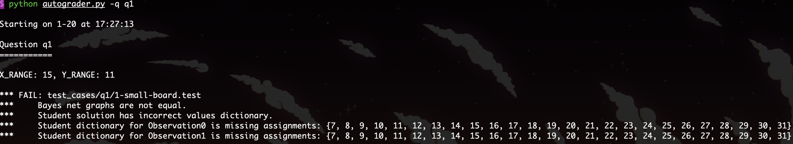
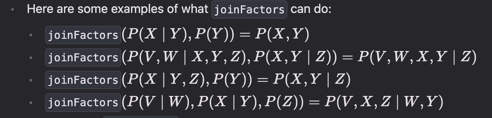
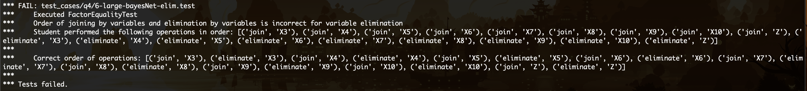
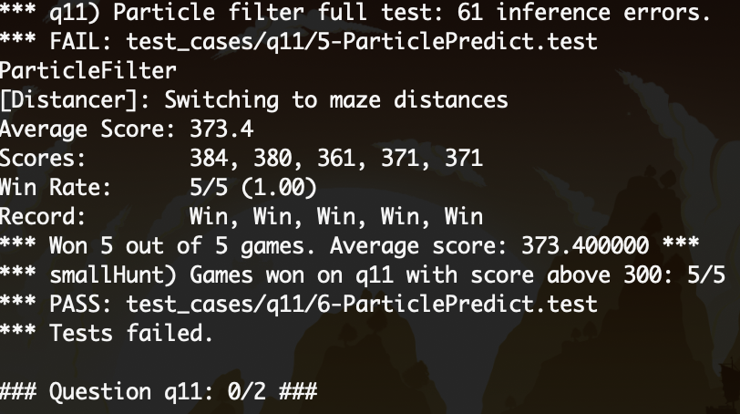

---
tags:
  - notes
data: 2024-08-11
comments: true
dg-publish: true
---

# Tracing

> [!PREREQUISITE]
>
> - [10-Intro_to_Probability](../note/10-Intro_to_Probability.md)
> - [11-Bayesian_Network_Intro](../note/11-Bayesian_Network_Intro.md)
> - [12-Variable_Elimination](../note/12-Variable_Elimination.md)
> - [13-Approximate_Inference](../note/13-Approximate_Inference.md)

## QuickReview

- $P(A|B)=\sum_{\omega\in A\cap B}P(\omega|B)=\frac{P(A\cap B)}{P(B)}=\frac{P(B|A)P(A)}{P(B)}$
- Inference By Enumeration（枚举推理，IBE） 
	- 枚举推理是一种通过列举所有可能的模型或赋值来计算概率推理的方法。该方法适用于离散变量，通常用于计算给定证据下的条件概率。通过对所有可能的赋值进行遍历，IBE能够准确地得出所需的概率值，但在处理大规模问题时可能会面临计算效率低下的问题。
- Variable Elimination（变量消元） 
	- 变量消元是一种用于概率图模型（如贝叶斯网络和马尔可夫随机场）的推理算法。该算法通过逐步消除不相关的变量，来计算条件概率或边际概率。变量消元的核心思想是将复杂的推理问题转化为较简单的计算，从而提高推理效率。

## explain

### Q1

非常重要的一步：把 bayesNet.py 大致看一遍，运行并对照 printStarterBayesNet 函数的内容对照查看输出，教导我们该如何创建、使用。

#### explore

在 [Question 1 (2 points): Bayes Net Structure](https://inst.eecs.berkeley.edu/~cs188/sp24/projects/proj4/#question-1-2-points-bayes-net-structure) 中很清楚的告诉我们应该干什么，仿照 printStarterBayesNet，声明 variables, edges, domains 即可。

在添加 variableDomainsDict[OBS0/1] 时出现了一些问题：起初设置 `variableDomainsDict[OBS0]=range(MAX_NOISE)`，出现下面的结果：



可见观察量应当是在考虑 noise 后的所有可能曼哈顿距离值，故找到 MAX_DISTANCE=X_RANGE+Y_RANGE 即可。

#### right

```python title="constructBayesNet"
def constructBayesNet(gameState: hunters.GameState):
    # constants to use
    PAC = "Pacman"
    GHOST0 = "Ghost0"
    GHOST1 = "Ghost1"
    OBS0 = "Observation0"
    OBS1 = "Observation1"
    X_RANGE = gameState.getWalls().width
    Y_RANGE = gameState.getWalls().height
    # print(f"\nX_RANGE: {X_RANGE}, Y_RANGE: {Y_RANGE}\n")
    MAX_NOISE = 7

    variables = []
    edges = []
    variableDomainsDict = {}

    "*** YOUR CODE HERE ***"
    MAX_DISTANCE = X_RANGE + Y_RANGE - 1
    variables = [PAC, GHOST0, GHOST1, OBS0, OBS1]
    edges = [(PAC, OBS0), (PAC, OBS1), (GHOST0, OBS0), (GHOST1, OBS1)]

    variableDomainsDict[PAC] = [(x, y) for x in range(X_RANGE) for y in range(Y_RANGE)]
    variableDomainsDict[GHOST0] = [(x, y) for x in range(X_RANGE) for y in range(Y_RANGE)]
    variableDomainsDict[GHOST1] = [(x, y) for x in range(X_RANGE) for y in range(Y_RANGE)]
    variableDomainsDict[OBS0] = range(MAX_DISTANCE + MAX_NOISE)
    variableDomainsDict[OBS1] = range(MAX_DISTANCE + MAX_NOISE)
    # raiseNotDefined()
    "*** END YOUR CODE HERE ***"

    net = bn.constructEmptyBayesNet(variables, edges, variableDomainsDict)
    return net
```

### Q2

#### explore



观察给我们的几个例子，不难发现在 joinFactors 后，condition bar `|` 左侧的变量仍然在左侧，剩下的在右侧；或者便于理解，只有不能够被推导的变量的概率置于右侧。

#### right

通过 python 的集合以及相关操作，我们可以很简单地实现：

```python title="joinFactors"
def joinFactors(factors: List[Factor]):
    # typecheck portion
    setsOfUnconditioned = [set(factor.unconditionedVariables()) for factor in factors]
    if len(factors) > 1:
        intersect = functools.reduce(lambda x, y: x & y, setsOfUnconditioned)
        if len(intersect) > 0:
            print("Factor failed joinFactors typecheck: ", factor)
            raise ValueError("unconditionedVariables can only appear in one factor. \n"
                    + "unconditionedVariables: " + str(intersect) + 
                    "\nappear in more than one input factor.\n" + 
                    "Input factors: \n" +
                    "\n".join(map(str, factors)))


    "*** YOUR CODE HERE ***"
    setsOfConditioned = [set(factor.conditionedVariables()) for factor in factors]
    # get all unconditioned and conditioned variables
    allUnconditionedVariables = functools.reduce(lambda x, y: x | y, setsOfUnconditioned)
    allConditionedVariables = functools.reduce(lambda x, y: x | y, setsOfConditioned)

    newUnconditionedVariables = allUnconditionedVariables
    newConditionedVariables = allConditionedVariables - allUnconditionedVariables

    newFactor = Factor(newUnconditionedVariables, newConditionedVariables, list(factors)[0].variableDomainsDict())

    for assignment in newFactor.getAllPossibleAssignmentDicts():
        p = 1
        for factor in factors:
            p *= factor.getProbability(assignment)
        newFactor.setProbability(assignment, p)
    return newFactor
    # raiseNotDefined()
    "*** END YOUR CODE HERE ***"
```

### Q3

#### explore

新的 Factor 不过是将 eliminationVariable 从 unconditionedVariables 中移除，并将所有包括其的 assignments 的概率相加。

#### right

```python title="eliminate"
def eliminate(factor: Factor, eliminationVariable: str):
    # autograder tracking -- don't remove
    if not (callTrackingList is None):
        callTrackingList.append(('eliminate', eliminationVariable))

    # typecheck portion
    if eliminationVariable not in factor.unconditionedVariables():
        print("Factor failed eliminate typecheck: ", factor)
        raise ValueError("Elimination variable is not an unconditioned variable " \
                        + "in this factor\n" + 
                        "eliminationVariable: " + str(eliminationVariable) + \
                        "\nunconditionedVariables:" + str(factor.unconditionedVariables()))
    
    if len(factor.unconditionedVariables()) == 1:
        print("Factor failed eliminate typecheck: ", factor)
        raise ValueError("Factor has only one unconditioned variable, so you " \
                + "can't eliminate \nthat variable.\n" + \
                "eliminationVariable:" + str(eliminationVariable) + "\n" +\
                "unconditionedVariables: " + str(factor.unconditionedVariables()))

    "*** YOUR CODE HERE ***"
    print(f"old factor: {factor}")
    newFactor = Factor(factor.unconditionedVariables() - set([eliminationVariable]), factor.conditionedVariables(), factor.variableDomainsDict())
    # get elimanationVariables's domain from old factor
    eliminateDomain = factor.variableDomainsDict()[eliminationVariable]
    for assignment in newFactor.getAllPossibleAssignmentDicts():
        p = 0
        assginmentWithEliVar = assignment.copy()
        # sum up all the probability of the assignment with the elimination variable
        for eli_val in eliminateDomain:
            assginmentWithEliVar[eliminationVariable] = eli_val
            p += factor.getProbability(assginmentWithEliVar)
        newFactor.setProbability(assignment, p)
        
    print(f"newFactor: {newFactor}")
    return newFactor
    # raiseNotDefined()
    "*** END YOUR CODE HERE ***"
```

### Q4

#### explore

在已有代码中，我们关注 inferenceByElimination 函数，因为这里很大程度上教我们如何使用一些相关的函数的使用及效果。关注到我们需要完成的 inferenceByVariableElimination 参数和返回非常相似，我们先将 IBE 的代码拷贝过来看看，将 variable 的遍历顺序改改（即类似于 `for joinVariable in eliminationOrder:`），运行有：



可以看到，IBE 的行为是先都 join 再都 eliminate，而 IBVE 是一边 join 一边 eliminate，这和我们 note 中 [IBE vs. VE](../note/12-Variable_Elimination.md#IBE%20vs.%20VE) 是一致的；此外，注意一下反复被提及的只有一个 unconditionedVariable 的情况。

#### right

```python title="IBVE"
def inferenceByVariableElimination(bayesNet: bn, queryVariables: List[str], evidenceDict: Dict, eliminationOrder: List[str]):
    # this is for autograding -- don't modify
    joinFactorsByVariable = joinFactorsByVariableWithCallTracking(callTrackingList)
    eliminate             = eliminateWithCallTracking(callTrackingList)
    if eliminationOrder is None: # set an arbitrary elimination order if None given
        eliminationVariables = bayesNet.variablesSet() - set(queryVariables) - set(evidenceDict.keys())
        eliminationOrder = sorted(list(eliminationVariables))

    "*** YOUR CODE HERE ***"
    factorsList = bayesNet.getAllCPTsWithEvidence(evidenceDict)

    # join all factors by variable
    for variable in eliminationOrder:
        factorsList, factor = joinFactorsByVariable(factorsList, variable)
        if len(factor.unconditionedVariables()) <= 1:
            continue
        factorsList.append(eliminate(factor, variable))

    return normalize(joinFactors(factorsList))
    # raiseNotDefined()
    "*** END YOUR CODE HERE ***"
```

### Q5

比较简单，可以自己写完了如果没过再来比对；特例有根据测试结果来处理的意味。

#### a

```python title="normalize"
def normalize(self):
    "*** YOUR CODE HERE ***"
    total = self.total()
    # 加上 total == 1 可以减少后续开销
    if total == 0 or total == 1:
        return
    for key in self.keys():
        self[key] /= total
    # raiseNotDefined()
    "*** END YOUR CODE HERE ***"

def sample(self):
    "*** YOUR CODE HERE ***"
    self.normalize()
    p = random.random() # [0, 1)
    total = 0
    for key in self.keys():
        total += self[key]
        if total > p:
            return key
    # raiseNotDefined()
    "*** END YOUR CODE HERE ***"
```

#### b

```python title="observation"
def getObservationProb(self, noisyDistance: int, pacmanPosition: Tuple, ghostPosition: Tuple, jailPosition: Tuple):
    "*** YOUR CODE HERE ***"
    # special case: ghost is in jail, code according to the testcase and results.
    if ghostPosition == jailPosition:
        return 1.0 if noisyDistance is None else 0.0
    elif noisyDistance is None:
        return 0.0
    trueDistance = manhattanDistance(pacmanPosition, ghostPosition)
    return busters.getObservationProbability(noisyDistance, trueDistance)
    # raiseNotDefined()
    "*** END YOUR CODE HERE ***"
```

### Q6

针对所有可能位置使用 Q5 实现的功能即可：

#### right

```python title="observe update"
def observeUpdate(self, observation: int, gameState: busters.GameState):
    "*** YOUR CODE HERE ***"
    pacmanPosition = gameState.getPacmanPosition()
    jailPosition = self.getJailPosition()
    for p in self.allPositions:
        self.beliefs[p] = self.getObservationProb(observation, pacmanPosition, p, jailPosition) * self.beliefs[p]
    # raiseNotDefined()
    "*** END YOUR CODE HERE ***"
    self.beliefs.normalize()
```

### Q7

#### explore

其实也就是知道所有的 P(newPos=n | oldPos=o) ，总的概率分布，相加即可。

起初如此更新：

```python title="elapse time v1"
def elapseTime(self, gameState: busters.GameState):
    "*** YOUR CODE HERE ***"
    for oldPos in self.allPositions:
        newPosDist = self.getPositionDistribution(gameState, oldPos)
        oldProb = self.beliefs[oldPos]
        for newPos in newPosDist.keys():
            self.beliefs[newPos] += oldProb * newPosDist[newPos]
    "*** END YOUR CODE HERE ***"
```

但是无疑，我们在第 5 行需要从原分布中寻找 oldProb，所以应该新起一个分布。
#### right

```python title="elapse time v2"
def elapseTime(self, gameState: busters.GameState):
    "*** YOUR CODE HERE ***"
    newBeliefs = DiscreteDistribution()
    for oldPos in self.allPositions:
        newPosDist = self.getPositionDistribution(gameState, oldPos)
        oldProb = self.beliefs[oldPos]
        for newPos in newPosDist.keys():
            newBeliefs[newPos] += oldProb * newPosDist[newPos]
    newBeliefs.normalize() # 无需也可
    self.beliefs = newBeliefs
    # raiseNotDefined()
    "*** END YOUR CODE HERE ***"
```

### Q8

#### explore

首先题目告诉我们将 ghost 最可能出现的地方认为是此时其位置；我们希望朝着最近的 ghost 出发。接下来和我们在前面几个 project 中一样，对执行每种行动进行评估（这里即为 mazeDistance），做出抉择。[szzxljr](https://github.com/szzxljr/CS188_Course_Projects/blob/7beea60ec9037fa5b750d211c90d814a954cbdfe/proj5_tracking/bustersAgents.py#L145)  给出了一种更加优雅的写法。

#### right

```python title="choose action"
def chooseAction(self, gameState: busters.GameState):
    pacmanPosition = gameState.getPacmanPosition()
    legal = [a for a in gameState.getLegalPacmanActions()]
    livingGhosts = gameState.getLivingGhosts()
    livingGhostPositionDistributions = \
        [beliefs for i, beliefs in enumerate(self.ghostBeliefs)
         if livingGhosts[i+1]]
    "*** YOUR CODE HERE ***"
    ghostPos = [beliefs.argMax() for beliefs in livingGhostPositionDistributions]
    # https://github.com/szzxljr/CS188_Course_Projects/blob/7beea60ec9037fa5b750d211c90d814a954cbdfe/proj5_tracking/bustersAgents.py#L145
    closeGhostPos = min(ghostPos, key = lambda pos : self.distancer.getDistance(pacmanPosition, pos))
    chosenAction = min(legal, key = lambda action : self.distancer.getDistance(Actions.getSuccessor(pacmanPosition, action), closeGhostPos))
    return chosenAction
    # raiseNotDefined()
    "*** END YOUR CODE HERE ***"
```

### Q9

#### explore

对于 particle filter ，可以先看 [Object Tracking Using Particle Filter](https://python.plainenglish.io/object-tracking-using-particle-filter-574af0f25045) ；有一些不同的是，在文章中可视化时用粒子的大小代表概率，而我们这里用的是粒子的数量（至少在 Q9 这里）。对于粒子数不是可行位置数的整数倍该怎么办，我其实没有直接被告诉如何处理；在测试报错下，就直接一个一个位置的放。

#### right

```python title="particle filter"
def initializeUniformly(self, gameState: busters.GameState):
    self.particles = []
    "*** YOUR CODE HERE ***"
    numPart = self.numParticles
    numPost = len(self.legalPositions)
    self.particles = [self.legalPositions[i % numPost] for i in range(numPart)]
    # raiseNotDefined()
    "*** END YOUR CODE HERE ***"

def getBeliefDistribution(self):
    "*** YOUR CODE HERE ***"
    beliefs = DiscreteDistribution()
    for part in self.particles:
        beliefs[part] += 1
    beliefs.normalize()
    return beliefs
    # raiseNotDefined()
    "*** END YOUR CODE HERE ***"
```

### Q10

#### explore

接下来，我们需要根据 observation 来更新粒子的分布；类比于我们上一个实现的 observeUpdate 函数，我们本应该将 getObservationProb 的结果乘以对应位置粒子数占总粒子数比例；但是由于我们记录的只是每个粒子的位置，所以直接遍历所有粒子更加方便，最后归一化即可。

```python title="observeUpdate"
def observeUpdate(self, observation: int, gameState: busters.GameState):
    "*** YOUR CODE HERE ***"
    beliefs = DiscreteDistribution()
    jailPosition = self.getJailPosition()
    pacmanPosition = gameState.getPacmanPosition()
    for part in self.particles:
        beliefs[part] += self.getObservationProb(observation, pacmanPosition, part, jailPosition)
    if beliefs.total() == 0:
        self.initializeUniformly(gameState)
    else:
        beliefs.normalize()
        self.particles = [beliefs.sample() for _ in range(self.numParticles)]
    self.beliefs = beliefs
    # raiseNotDefined()
    "*** END YOUR CODE HERE ***"
```

### Q11

#### explore

照猫画虎？仿照 ExactInference，有：

```python title="elapse time v1"
def elapseTime(self, gameState):
    "*** YOUR CODE HERE ***"
    newBeliefs = DiscreteDistribution()
    for part in self.particles:
        newPosDist = self.getPositionDistribution(gameState, part)
        for newPos in newPosDist.keys():
            newBeliefs[newPos] += newPosDist[newPos]
    newBeliefs.normalize()
    self.beliefs = newBeliefs
    self.particles = [self.beliefs.sample() for _ in range(self.numParticles)]
    # raiseNotDefined()
    "*** END YOUR CODE HERE ***"
```

但是会发现，这样是无法通过第五个测试样例的。



有点迷，直到我尝试对于每个 newPosDist 分别进行采样，发现通过了？额，

```python title="elapse time v2"
def elapseTime(self, gameState):
    "*** YOUR CODE HERE ***"
    newParticles = []
    for part in self.particles:
        newPosDist = self.getPositionDistribution(gameState, part)
        newParticles.append(newPosDist.sample())
    self.particles = newParticles
    self.beliefs = self.getBeliefDistribution()
    # raiseNotDefined()
    "*** END YOUR CODE HERE ***"
```

## pass

- [project-4 全通过](attachments/project-4-4.png)
- [全代码](https://github.com/Darstib/cs188/tree/main/project/solution)